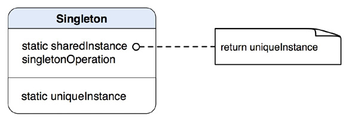

## IOS_ SingletonMode

## 单例模式
单例模式：所谓单例就是确保在程序运行过程中只创建一个对象实例。可以用于需要被多次广泛或者说多次使用的资源中，比如我们常见的网络请求类、工具类以及其它管理类等。比如我iOS开发中常见的系统单例［UIApplication sharedApplication］、［NSUserDefaults  standardUserDefaults］等。

## 类型
类型：创建类模式

## 类图

## 作用
它可以保证某个类在程序运行过程中最多只有一个实例，也就是对象实例只占用一份内存资源。

## 特点
单例模式有以下特点：
	
	1、单例类只能有一个实例。
	2、单例类必须自己创建自己的唯一实例。
	3、单例类必须给所有其他对象提供这一实例。
	
## 单例模式优缺点

### 优点
	1、提供了对唯一实例的受控访问。
	2、由于在系统内存中只存在一个对象，因此可以节约系统资源，
	对于一些需要频繁创建和销毁的对象单例模式无疑可以提高系统的性能。
	3、因为单例模式的类控制了实例化的过程，所以类可以更加灵活修改实例化过程。

### 缺点
	1、由于单利模式中没有抽象层，因此单例类的扩展有很大的困难。
	2、单例类的职责过重，在一定程度上违背了“单一职责原则”。
	

## 实现
1.为单例对象创建一个静态实例，可以写成全局的，也可以在类方法里面实现，并初始化为nil；

2.实现一个实例构造方法，检查上面声明的静态实例是否为nil，如果是，则创建并返回一个本类的实例；

3.重写allocWithZone方法，用来保证其他人直接使用alloc和init试图获得一个新实力的时候不产生一个新实例；

4.适当实现copyWithZone，mutableCopyWithZone，非arc下还需要实现release和autorelease方法。

## 参考
[JAVA设计模式之单例模式](https://blog.csdn.net/jason0539/article/details/23297037) 

[IOS开发之单例设计模式](https://www.cnblogs.com/JackieHoo/p/5050010.html)

[iOS中的单例模式](http://www.cocoachina.com/ios/20171123/21300.html)
