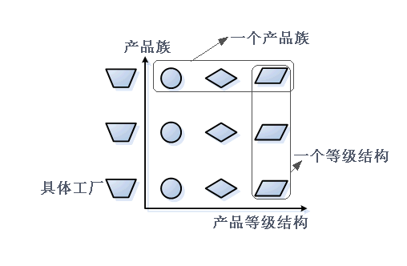
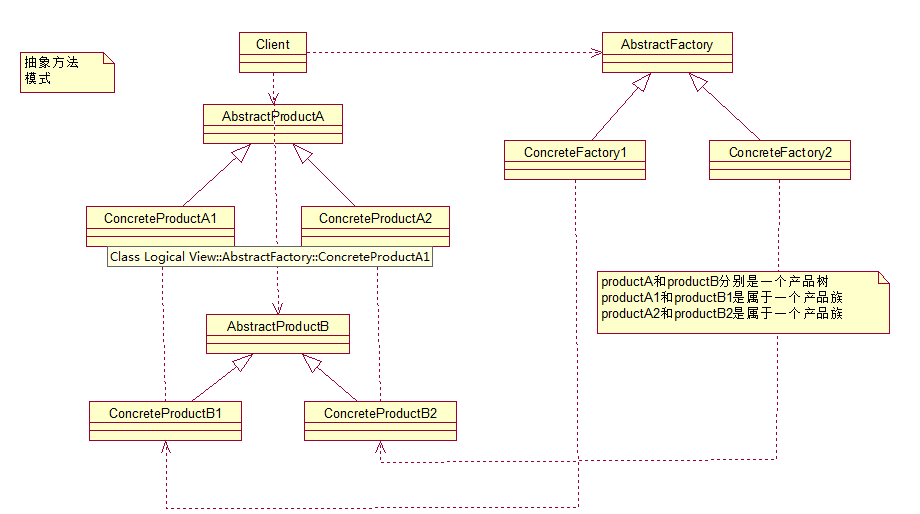
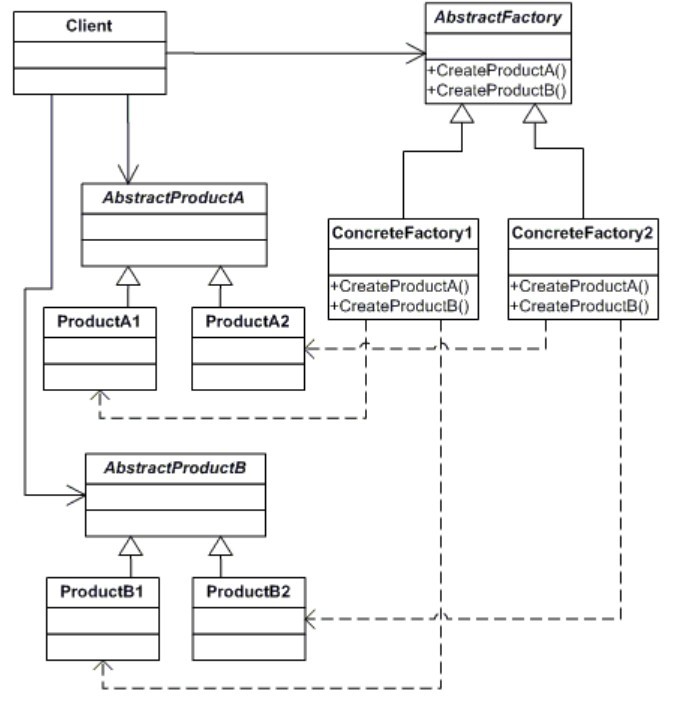
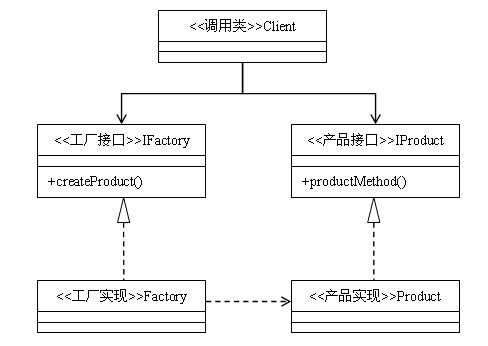

## IOS_AbstractFactoryMode

## 抽象工厂模式

抽象工厂模式：为创建一组相关或相互依赖的对象提供一个接口，而且无需指定他们的具体类。

抽象工厂模式是所有形态的工厂模式中最为抽象和最具一般性的一种形态。抽象工厂模式是指当有多个抽象角色时，使用的一种工厂模式。抽象工厂模式可以向客户端提供一个接口，使客户端在不必指定产品的具体的情况下，创建多个产品族中的产品对象。根据里氏替换原则，任何接受父类型的地方，都应当能够接受子类型。因此，实际上系统所需要的，仅仅是类型与这些抽象产品角色相同的一些实例，而不是这些抽象产品的实例。换言之，也就是这些抽象产品的具体子类的实例。工厂类负责创建抽象产品的具体子类的实例。

当每个抽象产品都有多于一个的具体子类的时候，工厂角色怎么知道实例化哪一个子类呢？比如每个抽象产品角色都有两个具体产品。抽象工厂模式提供两个具体工厂角色，分别对应于这两个具体产品角色，每一个具体工厂角色只负责某一个产品角色的实例化。每一个具体工厂类只负责创建抽象产品的某一个具体子类的实例。

每一个模式都是针对一定问题的解决方案，工厂方法模式针对的是一个产品等级结构；而抽象工厂模式针对的是多个产品等级结构。

抽象工厂模式是工厂方法模式的升级版本，他用来创建一组相关或者相互依赖的对象。他与工厂方法模式的区别就在于，工厂方法模式针对的是一个产品等级结构；而抽象工厂模式则是针对的多个产品等级结构。在编程中，通常一个产品结构，表现为一个接口或者抽象类，也就是说，工厂方法模式提供的所有产品都是衍生自同一个接口或抽象类，而抽象工厂模式所提供的产品则是衍生自不同的接口或抽象类。

### 产品族

产品族：是指位于不同产品等级结构中，功能相关联的产品组成的家族。一般是位于不同的等级结构中的相同位置上。显然，每一个产品族中含有产品的数目，与产品等级结构的数目是相等的，形成一个二维的坐标系，水平坐标是产品等级结构，纵坐标是产品族。叫做相图。

当有多个不同的等级结构的产品时，如果使用工厂方法模式就势必要使用多个独立的工厂等级结构来对付这些产品的等级结构。如果这些产品等级结构是平行的，会导致多个平行的工厂等级结构。

抽象工厂模式使用同一个 工厂等级结构负责这些不同产品等级结构产品对象的创建。

对于每一个产品族，都有一个具体工厂。而每一个具体工厂创建属于同一个产品族，但是分属于不同等级结构的产品。

通过引进抽象工厂模式，可以处理具有相同（或者相似）等级结构的多个产品族中的产品对象的创建问题。

由于每个具体工厂角色都需要负责两个不同等级结构的产品对象的创建，因此每个工厂角色都需要提供两个工厂方法，分别用于创建两个等级结构的产品。既然每个具体工厂角色都需要实现这两个工厂方法，所以具有一般性，不妨抽象出来，移动到抽象工厂角色中加以声明。

### 产品族相图

## 类型

创建模式

## 结构图

#### 图1

#### 图2

#### 图3

## 角色

* 抽象工厂角色（Factory）： 这是抽象工厂模式的核心，它与应用程序无关。是具体工厂角色必须实现的接口或者必须继承的父类。一般由抽象类或者接口来实现。 

* 具体工厂角色（Concrete Factory）：它含有和具体业务逻辑有关的代码。由应用程序调用以创建对应的具体产品的对象。 

* 抽象产品角色（Product）：它是具体产品继承的父类或者是实现的接口。一般由抽象类或者接口来实现。 

* 具体产品角色（Concrete Product）：具体工厂角色所创建的对象就是此角色的实例。由具体的类来实现。

## 适用场景

1. 当需要创建的对象是一系列相互关联或相互依赖的产品族时，便可以使用抽象工厂模式。说的更明白一点，就是一个继承体系中，如果存在着多个等级结构（即存在着多个抽象类），并且分属各个等级结构中的实现类之间存在着一定的关联或者约束，就可以使用抽象工厂模式。假如各个等级结构中的实现类之间不存在关联或约束，则使用多个独立的工厂来对产品进行创建，则更合适一点。

2. 系统的产品有多于一个的产品族，而系统只消费其中某一族的产品。

## 优缺点

#### 优点

1. 抽象工厂模式除了具有工厂方法模式的优点外，最主要的优点就是可以在类的内部对产品族进行约束。所谓的产品族，一般或多或少的都存在一定的关联，抽象工厂模式就可以在类内部对产品族的关联关系进行定义和描述，而不必专门引入一个新的类来进行管理。

2. 封装了产品的创建，使得不需要知道具体是哪种产品，只需要知道是哪个工厂就行了。

3. 可以支持不同类型的产品，使得模式灵活性更强。

4. 可以非常方便的使用一族中间的不同类型的产品。

#### 缺点

1. 结构太过臃肿，如果产品类型比较多，或者产品族类比较多，就会非常难于管理。

2. 每次如果添加一组产品，那么所有的工厂类都必须添加一个方法，这样违背了开放-封闭原则。所以一般适用于产品组合产品族变化不大的情况。

## 总结

无论是简单工厂模式，工厂方法模式，还是抽象工厂模式，他们都属于工厂模式，在形式和特点上也是极为相似的，他们的最终目的都是为了解耦。在使用时，我们不必去在意这个模式到底工厂方法模式还是抽象工厂模式，因为他们之间的演变常常是令人琢磨不透的。经常你会发现，明明使用的工厂方法模式，当新需求来临，稍加修改，加入了一个新方法后，由于类中的产品构成了不同等级结构中的产品族，它就变成抽象工厂模式了；而对于抽象工厂模式，当减少一个方法使的提供的产品不再构成产品族之后，它就演变成了工厂方法模式。

所以，在使用工厂模式时，只需要关心降低耦合度的目的是否达到了。

## 参考

[23种设计模式（3）：抽象工厂模式](https://blog.csdn.net/zhengzhb/article/details/7359385)

[抽象工厂模式](https://baike.baidu.com/item/%E6%8A%BD%E8%B1%A1%E5%B7%A5%E5%8E%82%E6%A8%A1%E5%BC%8F/2361182?fr=aladdin)

[JAVA设计模式之工厂模式(简单工厂模式+工厂方法模式)](https://blog.csdn.net/jason0539/article/details/23020989)

[JAVA设计模式之抽象工厂模式](https://blog.csdn.net/jason0539/article/details/44976775)

[设计模式（一）工厂模式Factory（创建型）](https://blog.csdn.net/hguisu/article/details/7505909)

[简单工厂、工厂方法、抽象工厂、策略模式、策略与工厂的区别](https://www.cnblogs.com/zhangchenliang/p/3700820.html)

[三种工厂模式的分析以及C++实现](https://www.cnblogs.com/cxjchen/p/3143633.html)

[工厂模式](https://baike.baidu.com/item/%E5%B7%A5%E5%8E%82%E6%A8%A1%E5%BC%8F/9852061?fr=aladdin)

[Java设计模式圣经连载（03）－抽象工厂模式](http://blog.51cto.com/lavasoft/11674)