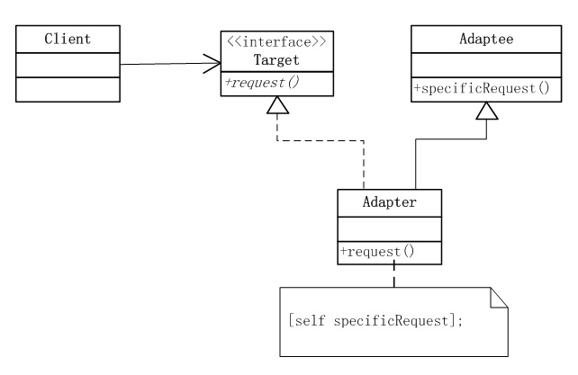
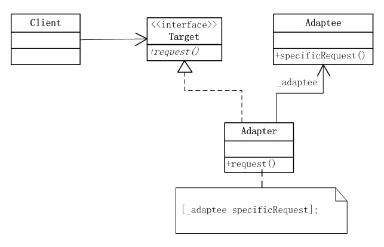

## IOS_AdapterMode

## 适配器模式
适配器模式：将一个类的接口转换成客户希望的另外一个接口。Adapter模式使得原本由于接口不兼容而不能一起工作的那些类可以在一起工作。

比如手机充电器，手机是不能在220V电源上直接充电的，充电器将电压转换成手机需要的电压后，手机才可以正常充电，这个充电器就起到了适配的作用。

有两种实现适配器模式的方式。

第一种是通过继承来适配两个接口，这称为类适配器。

在OC中，类可以实现协议，同时又继承父类，达到C++多继承的效果。要在OC中实现类适配器，首先需要有定义了客户端要使用的一套行为的协议，然后要用具体的适配器类来实现这个协议。适配器类同时也要继承被适配者。

Adapter是一个Target类型，同时也是Adaptee类型。它重载了Target的request方法，没有重载Adaptee中的specificRequest方法，而是在Adapter的request方法的实现中，调用父类的specificRequest方法。只有当Target是协议而不是类时，类适配器才能够用OC来实现，因为OC中是没有多重继承的。

第二种方式称为对象适配器。与类适配器不同，对象适配器不继承被适配者，而是组合了一个对它的引用。OC中常用的委托(Delegate)模式属于对象适配器

Target和Adapter的关系相同，Adapter和Adaptee之间的关系，由继承变成了关联。这种关系下，Adapter需要保持一个对Adaptee的引用。在request方法中，Adapter发送[_adaptee specificRequest]消息给Adaptee，以完成客户端的请求。

## 类型
类型：结构性模式

## 结构图
类适配器
 

对象适配器

## 总结
#### 优点
1. 通过适配器，客户端可以调用同一接口，因而对客户端来说是透明的。这样做更简单、更直接、更紧凑。
2. 复用了现存的类，解决了现存类和复用环境要求不一致的问题。
3. 将目标类和适配者类解耦，通过引入一个适配器类重用现有的适配者类，而无需修改原有代码。
4. 一个对象适配器可以把多个不同的适配者类适配到同一个目标，也就是说，同一个适配器可以把适配者类和它的子类都适配到目标接口。

#### 缺点
对于对象适配器来说，更换适配器的实现过程比较复杂。

#### 适用场景
1. 系统需要使用现有的类，而这些类的接口不符合系统的接口。
2. 想要建立一个可以重用的类，用于与一些彼此之间没有太大关联的一些类，包括一些可能在将来引进的类一起工作。
3. 两个类所做的事情相同或相似，但是具有不同接口的时候。
4. 旧的系统开发的类已经实现了一些功能，但是客户端却只能以另外接口的形式访问，但我们不希望手动更改原有类的时候。
5. 使用第三方组件，组件接口定义和自己定义的不同，不希望修改自己的接口，但是要使用第三方组件接口的功能。

