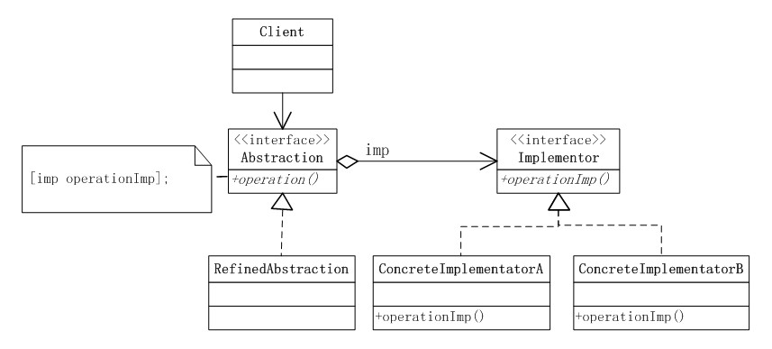
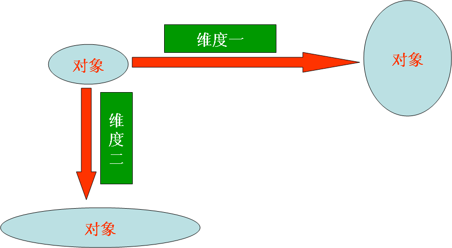
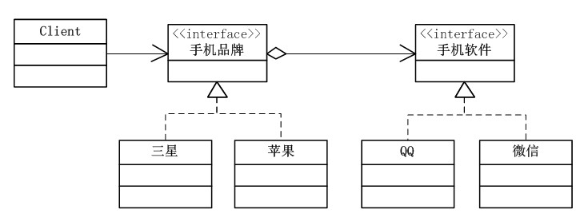

## IOS_BridgeMode

## 桥接模式

桥接模式：将抽象部分与它的实现部分分离开来，使他们都可以独立变化。又称为柄体(Handle and Body)模式或接口(Interface)模式。

桥接模式将继承关系转化成关联关系，它降低了类与类之间的耦合度，减少了系统中类的数量，也减少了代码量。

将抽象部分与他的实现部分分离这句话不是很好理解，其实这并不是将抽象类与他的派生类分离，而是抽象类和它的派生类用来实现自己的对象。这样还是不能理解的话。我们就先来认清什么是抽象化，什么是实现化，什么是脱耦。

抽象化：将复杂物体的一个或几个特性抽出去而只注意其他特性的行动或过程。在面向对象就是将对象共同的性质抽取出去而形成类的过程。

实现化：针对抽象化给出的具体实现。它和抽象化是一个互逆的过程，实现化是对抽象化事物的进一步具体化。

脱耦：脱耦就是将抽象化和实现化之间的耦合解脱开，或者说是将它们之间的强关联改换成弱关联，将两个角色之间的继承关系改为关联关系。

对于那句话：将抽象部分与他的实现部分分离套用《大话设计模式》里面的就是实现系统可能有多个角度分类，每一种角度都可能变化，那么把这种多角度分类给分离出来让他们独立变化，减少他们之间耦合。

桥接模式中的所谓脱耦，就是指在一个软件系统的抽象化和实现化之间使用关联关系（组合或者聚合关系）而不是继承关系，从而使两者可以相对独立地变化，这就是桥接模式的用意。

## 类型

结构模式

## 结构图

## 分析图

## 例子图

## 角色

* 抽象化(Abstraction)角色：抽象化给出的定义，并保存一个对实现化对象的引用。在抽象对象里面的方法，需要调用实现部分的对象来完成。这个对象里面的方法，通常都是跟具体的业务相关的方法。
* 修正抽象化(Refined Abstraction)角色：抽象部分的具体实现，扩展抽象化角色，改变和修正父类对抽象化的定义。这些方法的实现通常会使用Abstraction中定义的方法，也可能需要调用实现部分的对象来完成。
* 实现化(Implementor)角色：这个角色给出实现化角色的接口，但不给出具体的实现。必须指出的是，这个接口不一定和抽象化角色的接口定义相同，实际上，这两个接口可以非常不一样。实现化角色应当只给出底层操作，而抽象化角色应当只给出基于底层操作的更高一层的操作。这个接口不用和Abstraction里面的方法一致，通常是由Implementor接口提供基本的操作，而Abstraction里面定义的是基于这些基本操作的业务方法，也就是说Abstraction定义了基于这些基本操作的较高层次的操作。
* 具体实现化(Concrete Implementor)角色：这个角色给出实现化角色接口的具体实现。

## 桥接模式的优缺点

### 优点

* 分离抽象接口及其实现部分。提高了比继承更好的解决方案。
* 桥接模式提高了系统的可扩充性，在两个变化维度中任意扩展一个维度，都不需要修改原有系统。
* 实现细节对客户透明，可以对用户隐藏实现细节。

### 缺点

* 桥接模式的引入会增加系统的理解与设计难度，由于聚合关联关系建立在抽象层，要求开发者针对抽象进行设计与编程。 
* 桥接模式要求正确识别出系统中两个独立变化的维度，因此其使用范围具有一定的局限性。

## 适用场景

1. 如果一个系统需要在抽象化和具体化之间增加更多的灵活性，避免在两个层次之间建立静态的继承关系，通过桥接模式可以使它们在抽象层建立一个关联关系。
2. “抽象部分”和“实现部分”可以以继承的方式独立扩展而互不影响，在程序运行时可以动态将一个抽象化子类的对象和一个实现化子类的对象进行组合，即系统需要对抽象化角色和实现化角色进行动态耦合。
3. 一个类存在两个（或多个）独立变化的维度，且这两个（或多个）维度都需要独立进行扩展。
4. 对于那些不希望使用继承或因为多层继承导致系统类的个数急剧增加的系统，桥接模式尤为适用。

## 总结

1. 桥接模式实现了抽象化与实现化的脱耦。他们两个互相独立，不会影响到对方。
2. 对于两个（或多个）独立变化的维度，使用桥接模式再适合不过了。
3. 对于“具体的抽象类”所做的改变，是不会影响到客户。
4. 桥接模式为多维度变化的系统提供了一套完整的解决方案，并且降低了系统的复杂度。

## 参考

[设计模式读书笔记-----桥接模式](http://www.cnblogs.com/chenssy/p/3317866.html)

[java设计模式之桥接模式](https://www.cnblogs.com/lfxiao/p/6815760.html)

[IOS设计模式浅析之桥接模式(Bridge)](http://www.cnblogs.com/eagle927183/p/3483890.html)

[浅谈JAVA设计模式之——桥接模式（Bridge）](https://blog.csdn.net/l1028386804/article/details/45457969)

[设计模式之桥接模式](https://www.cnblogs.com/lixiuyu/p/5923160.html)