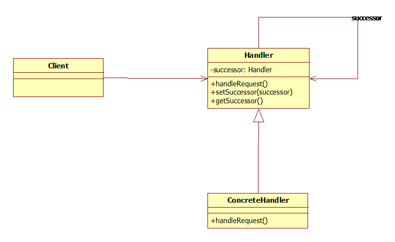
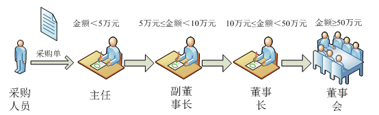
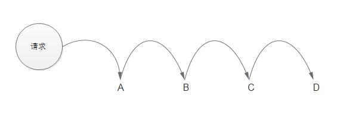

## IOS_ChainOfResponsibilityMode

## 责任链模式（职责链模式）

责任链模式（职责链模式）：使多个对象都有机会处理请求，从而避免请求的发送者和接受者之间的耦合关系。将这些对象连成一条链，并沿着这条链传递该请求，直到有对象能够处理它。

## 类型

行为模式

## 结构图

#### 图1

#### 图2

#### 图3

## 角色
* 抽象处理者角色(Handler)：定义出一个处理请求的接口。如果需要，接口可以定义出一个方法以设定和返回对下家的引用。这个角色通常由一个抽象类或者接口实现。

* 具体处理者角色(ConcreteHandler)：具体处理者接到请求后，可以选择将请求处理掉，或者将请求传给下家。由于具体处理者持有对下家的引用，因此，如果需要，具体处理者可以访问下家。
抽象处理者角色

## 适用场景

1. Java中，异常机制就是一个责任链模式，一个try可以对应多个catch,当第一个catch不匹配类型，则自动跳到第二个catch.

2. ios 中的响应链。

## 优缺点

#### 优点

1. 降低耦合度：客户端不需要知道请求由哪个处理者处理，而处理者也不需要知道处理者之间的传递关系，由系统灵活的组织和分配。

2. 良好的扩展性：增加处理者的实现很简单，只需重写处理请求业务逻辑的方法。

#### 缺点

1. 请求会从链头发出，直到有处理者响应，在责任链比较长的时候会影响系统性能。

2. 请求递归，调试排错比较麻烦。

## 注意

纯的与不纯的责任链模式

一个纯的责任链模式要求一个具体的处理者对象只能在两个行为中选择一个，一是承担责任，二是把责任推给下家。不允许出现某一个具体处理者对象在承担了一部分责任后又把责任向下传的情况。

在一个纯的责任链模式里面，一个请求必须被某一个处理者对象所接收；在一个不纯的责任链模式里面，一个请求可以最终不被任何接收端对象所接收。

纯的责任链模式的实际例子很难找到，一般看到的例子均是不纯的责任链模式的实现。

## 参考

[Java设计模式之责任链模式、职责链模式](https://blog.csdn.net/jason0539/article/details/45091639)

[设计模式-责任链模式](https://www.cnblogs.com/fanyang219/p/6432815.html)

[设计模式——责任链](https://blog.csdn.net/liuchangqing123/article/details/7386912)

[Java设计模式----责任链模式](https://blog.csdn.net/u012810020/article/details/71194853)