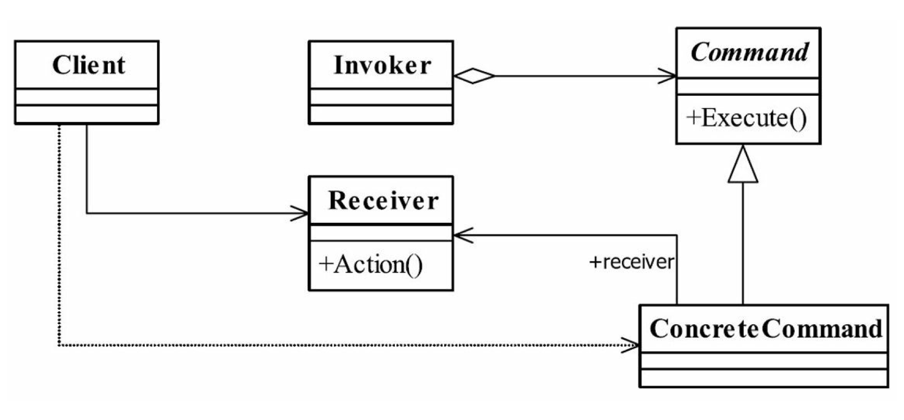
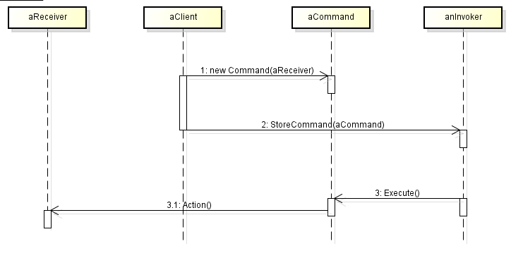

## IOS_CommandMode_README

## 命令模式
命令模式：将一个请求封装为一个对象，从而让我们可用不同的请求对客户进行参数化；对请求排队或者记录请求日志，以及支持可撤销的操作。命令模式是一种对象行为型模式，其别名为动作(Action)模式或事务(Transaction)模式。

用于“行为请求者”与“行为实现者”解耦，可实现二者之间的松耦合，以便适应变化。分离变化与不变的因素。

## 类型

行为模式

## 结构图

#### 图1

#### 图2

## 角色

* 抽象命令类（Command）：定义命令的接口，声明执行的方法。

抽象命令类一般是一个抽象类或接口，在其中声明了用于执行请求的execute()等方法，通过这些方法可以调用请求接收者的相关操作。

* 具体命令类（ConcreteCommand）：命令接口实现对象，是“虚”的实现；通常会持有接收者，并调用接收者的功能来完成命令要执行的操作。

具体命令类是抽象命令类的子类，实现了在抽象命令类中声明的方法，它对应具体的接收者对象，将接收者对象的动作绑定其中。在实现execute()方法时，将调用接收者对象的相关操作(Action)。

* 调用者（Invoker）：要求命令对象执行请求，通常会持有命令对象，可以持有很多的命令对象。这个是客户端真正触发命令并要求命令执行相应操作的地方，也就是说相当于使用命令对象的入口。

调用者即请求发送者，它通过命令对象来执行请求。一个调用者并不需要在设计时确定其接收者，因此它只与抽象命令类之间存在关联关系。在程序运行时可以将一个具体命令对象注入其中，再调用具体命令对象的execute()方法，从而实现间接调用请求接收者的相关操作。

* 接收者（Receiver）：接收者，真正执行命令的对象。任何类都可能成为一个接收者，只要它能够实现命令要求实现的相应功能。

接收者执行与请求相关的操作，它具体实现对请求的业务处理。

## 适用场景

1. 命令的发送者和命令执行者有不同的生命周期。命令发送了并不是立即执行。

2. 系统需要将请求调用者和请求接收者解耦，使得调用者和接收者不直接交互。

3. 系统需要在不同的时间指定请求、将请求排队和执行请求。

4. 系统需要支持命令的撤销(Undo)操作和恢复(Redo)操作。

5. 系统需要将一组操作组合在一起，即支持宏命令。

## 优缺点

#### 优点
1. 降低对象之间的耦合度。

2. 新的命令可以很容易地加入到系统中。

3. 可以比较容易地设计一个组合命令。

4. 调用同一方法实现不同的功能

#### 缺点

* 使用命令模式可能会导致某些系统有过多的具体命令类。因为针对每一个命令都需要设计一个具体命令类，因此某些系统可能需要大量具体命令类，这将影响命令模式的使用。

## 总结

1. 命令模式是通过命令发送者和命令执行者的解耦来完成对命令的具体控制的。

2. 命令模式是对功能方法的抽象，并不是对对象的抽象。

3. 命令模式是将功能提升到对象来操作，以便对多个功能进行一系列的处理以及封装。

4. 命令模式的本质是对命令进行封装，将发出命令的责任和执行命令的责任分割开。

5. 每一个命令都是一个操作：请求的一方发出请求，要求执行一个操作；接收的一方收到请求，并执行操作。

6. 命令模式允许请求的一方和接收的一方独立开来，使得请求的一方不必知道接收请求的一方的接口，更不必知道请求是怎么被接收，以及操作是否被执行、何时被执行，以及是怎么被执行的。

7. 命令模式使请求本身成为一个对象，这个对象和其他对象一样可以被存储和传递。

8. 命令模式的关键在于引入了抽象命令接口，且发送者针对抽象命令接口编程，只有实现了抽象命令接口的具体命令才能与接收者相关联。

## 参考

[Java设计模式之命令模式](https://blog.csdn.net/jason0539/article/details/45110355)

[理解设计模式之----命令模式](https://www.cnblogs.com/konck/p/4199907.html)

[设计模式-命令模式](https://www.cnblogs.com/f-zhao/p/6203208.html)