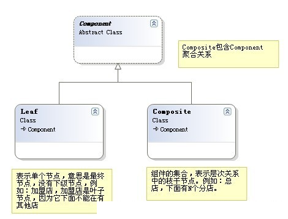
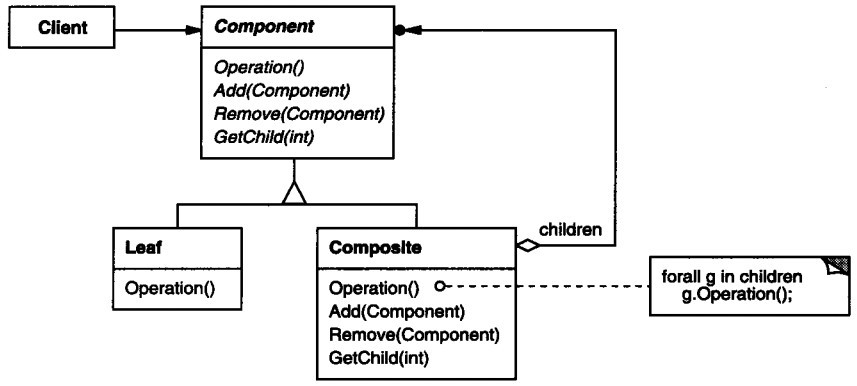
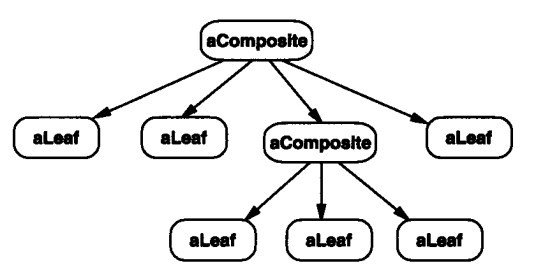
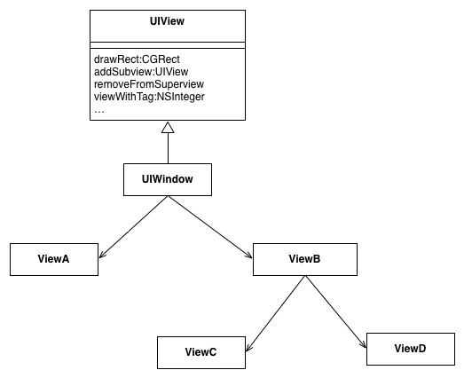

## IOS_CompositeMode

## 组合模式
组合模式：将对象组合成树形结构以表示“部分-整体”的层次结构，组合模式使得用户对单个对象和组合对象的使用具有一致性。

有时候又叫做部分-整体模式，它使我们树型结构的问题中，模糊了简单元素和复杂元素的概念，客户程序可以像处理简单元素一样来处理复杂元素,从而使得客户程序与复杂元素的内部结构解耦。

组合模式让你可以优化处理递归或分级数据结构。有许多关于分级数据结构的例子，使得组合模式非常有用武之地。关于分级数据结构的一个普遍性的例子是你每次使用电脑时所遇到的:文件系统。文件系统由目录和文件组成。每个目录都可以装内容。目录的内容可以是文件，也可以是目录。按照这种方式，计算机的文件系统就是以递归结构来组织的。如果你想要描述这样的数据结构，那么你可以使用组合模式Composite。

## 类型
结构模式

## 结构图
图1

图2

composite对象结构

## 角色
* Component 是组合中的对象声明接口，在适当的情况下，实现所有类共有接口的默认行为。声明一个接口用于访问和管理Component子部件。
* Leaf 在组合中表示叶子结点对象，叶子结点没有子结点。
* Composite 定义有枝节点行为，用来存储子部件，在Component接口中实现与子部件有关操作，如增加(add)和删除(remove)等。

## 适用性
* 你想表示对象的部分-整体层次结构
* 你希望用户忽略组合对象与单个对象的不同，用户将统一地使用组合结构中的所有对象。

## 适用场景
1. 在具有整体和部分的层次结构中，希望通过一种方式忽略整体与部分的差异，客户端可以一致地对待它们。引用大话设计模式的片段：“当发现需求中是体现部分与整体层次结构时，以及你希望用户可以忽略组合对象与单个对象的不同，统一地使用组合结构中的所有对象时，就应该考虑组合模式了。” 
2. 在一个使用面向对象语言开发的系统中需要处理一个树形结构。 
3. 在一个系统中能够分离出叶子对象和容器对象，而且它们的类型不固定，需要增加一些新的类型。

## 组合模式实例
* 多级树形菜单。
* 文件和文件夹目录
* ios中使用实例：在Cocoa Touch框架中，UIView对象被组合成一个树形结构，UIView对象可以包含其他的UIView对象。这种组合方式便于统一用于事件处理和动作消息，例如处理渲染事件时，事件会在父视图中被处理，然后在传递给子视图，因为他们都是相同的类型，事件可以传递到树形结构的每一视图。

## 总结
组合模式解耦了客户程序与复杂元素内部结构，从而使客户程序可以像处理简单元素一样来处理复杂元素。

如果你想要创建层次结构，并可以在其中以相同的方式对待所有元素，那么组合模式就是最理想的选择。

## 参考
[JAVA设计模式初探之组合模式](https://blog.csdn.net/jason0539/article/details/22642281)

[设计模式（七）组合模式Composite（结构型）](https://blog.csdn.net/hguisu/article/details/7530783)

[iOS 设计模式 - 组合模式](https://blog.csdn.net/seal_shile/article/details/50752668)

[百度百科](https://baike.baidu.com/item/%E7%BB%84%E5%90%88%E6%A8%A1%E5%BC%8F/1441281?fr=aladdin)