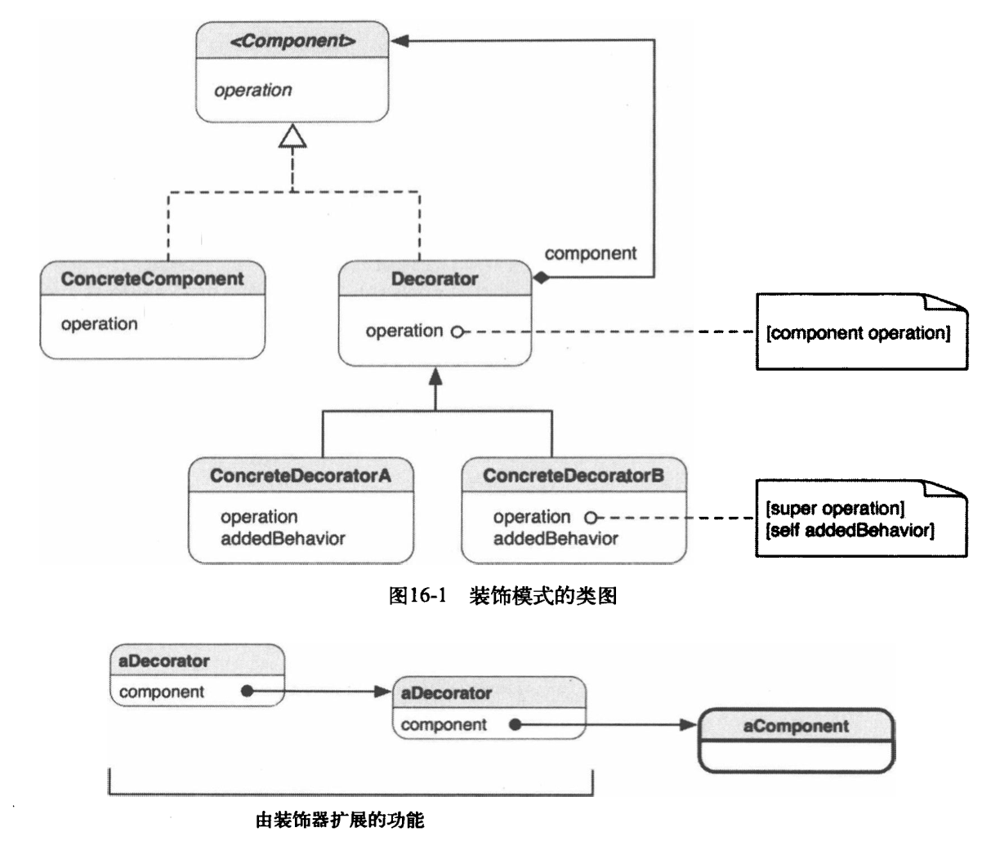

## IOS_DecoratorMode

## 装饰者模式（装饰器模式）

装饰者模式：动态给一个对象添加一些额外的职责,就象在墙上刷油漆.使用Decorator模式相比用生成子类方式达到功能的扩充显得更为灵活。

通常可以使用继承来实现功能的拓展,如果这些需要拓展的功能的种类很繁多,那么势必生成很多子类,增加系统的复杂性,同时,使用继承实现功能拓展,我们必须可预见这些拓展功能,这些功能是编译时就确定了,是静态的。

## 类型
结构模式

## 结构图

## 特征
1. 装饰者（decorator）和被装饰（扩展）的对象有着相同的超类（supertype）。
2. 我们可以用多个装饰者去装饰一个对象。
3. 我们可以用装饰过的对象替换代码中的原对象，而不会出问题（因为他们有相同的超类）。
4. 装饰者可以在委托（delegate，即调用被装饰的类的成员完成一些工作）被装饰者的行为完成之前或之后加上他自己的行为。
5. 一个对象能在任何时候被装饰，甚至是运行时。

### 何时使用装饰模式
1. 想要在不影响其他对象的情况下，以动态、透明的方式给单个对象添加职责。
2. 想要扩展一个类的行为，却做不到。类定义可能被隐藏，无法进行子类化；或者对类的每个行为的扩展，为支持每种功能组合，将产生大量的子类
3. 对类的职责的扩展是可选的。

### 装饰模式在iOS中的实现

根据OC的特性，有两种实现方式：

1. 通过真正的子类实现装饰
2. 通过分类实现装饰

第2种方式是使用了OC的语言功能，通过分类向类添加行为，不必进行子类化，这并非标准的装饰模式结构，但是实现了装饰模式同样的需求。尽管使用分类来实现装饰模式跟原始风格有偏离，但是实现少量的装饰器的时候，它比真正子类方式更加轻量、更加容易。

## 装饰者模式的优缺点
#### 优点
* 装饰者模式可以提供比继承更多的灵活性
* 可以通过一种动态的方式来扩展一个对象的功能，在运行时选择不同的装饰器，从而实现不同的行为。
* 通过使用不同的具体装饰类以及这些装饰类的排列组合，可以创造出很多不同行为的组合。可以使用多个具体装饰类来装饰同一对象，得到功能更为强大的对象。
* 具体构件类与具体装饰类可以独立变化，用户可以根据需要增加新的具体构件类和具体装饰类，在使用时再对其进行组合，原有代码无须改变，符合“开闭原则”。

#### 缺点
* 会产生很多的小对象，增加了系统的复杂性
* 这种比继承更加灵活机动的特性，也同时意味着装饰模式比继承更加易于出错，排错也很困难，对于多次装饰的对象，调试时寻找错误可能需要逐级排查，较为烦琐。

## 装饰者的使用场景

1. 在不影响其他对象的情况下，以动态、透明的方式给单个对象添加职责。
2. 需要动态地给一个对象增加功能，这些功能也可以动态地被撤销。  当不能采用继承的方式对系统进行扩充或者采用继承不利于系统扩展和维护时。

## 参考
[JAVA设计模式初探之装饰者模式](https://blog.csdn.net/jason0539/article/details/22713711)

[Objective-C中的装饰模式](https://www.jianshu.com/p/fe1cc2978a1d)

[iOS 设计模式系列二：装饰者模式
](https://www.jianshu.com/p/b4832dc54a95)

[装饰者模式及其应用
](https://blog.csdn.net/gdutxiaoxu/article/details/51885105)