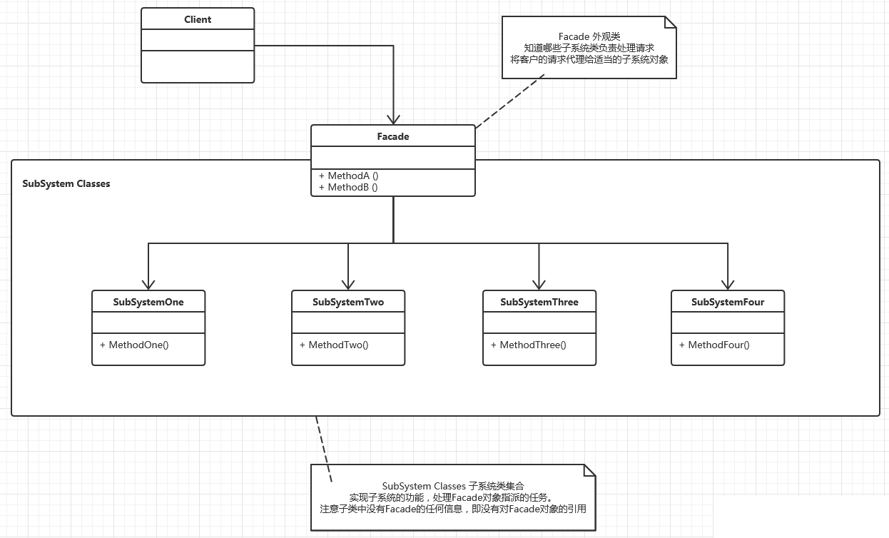

## IOS_FacadeMode

## 外观模式（门面模式）

外观模式（门面模式）：为系统中的一组接口提供一个一致的界面，此模式定义了一个高层接口，这个接口使得子系统更加容易使用。

隐藏系统的复杂性，并向客户端提供了一个客户端可以访问系统的接口。这种类型的设计模式属于结构型模式，它向现有的系统添加一个接口，来隐藏系统的复杂性。

这种模式涉及到一个单一的类，该类提供了客户端请求的简化方法和对现有系统类方法的委托调用。

## 类型
结构模式

## 结构图

## 角色扮演
1. 门面(Facade)角色 ：客户端可以调用这个角色的方法。此角色知晓相关的（一个或者多个）子系统的功能和责任。在正常情况下，本角色会将所有从客户端发来的请求委派到相应的子系统去。
2. 子系统(SubSystem)角色 ：可以同时有一个或者多个子系统。每个子系统都不是一个单独的类，而是一个类的集合（如上面的子系统就是由One、Two、Three 等组合而成）。每个子系统都可以被客户端直接调用，或者被门面角色调用。子系统并不知道门面的存在，对于子系统而言，门面仅仅是另外一个客户端而已。

Facade类其实相当于One、Two、Three等模块的外观界面，有了这个Facade类，那么客户端就不需要亲自调用子系统中的模块了，也不需要知道系统内部的实现细节，甚至都不需要知道子系统模块的存在，客户端只需要跟Facade类交互就好了，从而更好地实现了客户端和子系统模块的解耦，让客户端更容易地使用系统。

使用门面模式还有一个附带的好处，就是能够有选择性地暴露方法。一个模块中定义的方法可以分成两部分，一部分是给子系统外部使用的，一部分是子系统内部模块之间相互调用时使用的。有了Facade类，那么用于子系统内部模块之间相互调用的方法就不用暴露给子系统外部了。

## 一个系统可以有几个门面类
在门面模式中，通常只需要一个门面类，并且此门面类只有一个实例，换言之它是一个单例类。当然这并不意味着在整个系统里只有一个门面类，而仅仅是说对每一个子系统只有一个门面类。或者说，如果一个系统有好几个子系统的话，每一个子系统都有一个门面类，整个系统可以有数个门面类。

## 为子系统增加新行为
初学者往往以为通过继承一个门面类便可在子系统中加入新的行为，这是错误的。门面模式的用意是为子系统提供一个集中化和简化的沟通管道，而不能向子系统加入新的行为。比如医院中的接待员并不是医护人员，接待员并不能为病人提供医疗服务。

## 优点
1. 松散耦合

门面模式松散了客户端与子系统的耦合关系，让子系统内部的模块能更容易扩展和维护。

2. 简单易用

门面模式让子系统更加易用，客户端不再需要了解子系统内部的实现，也不需要跟众多子系统内部的模块进行交互，只需要跟门面类交互就可以了。

3. 更好的划分访问层次

通过合理使用Facade，可以帮助我们更好地划分访问的层次。有些方法是对系统外的，有些方法是系统内部使用的。把需要暴露给外部的功能集中到门面中，这样既方便客户端使用，也很好地隐藏了内部的细节。

## 缺点
不符合开闭原则，如果要改东西很麻烦，继承重写都不合适。

## 使用场景
1. 为复杂的模块或子系统提供外界访问的模块。 

	子系统往往会因为不断的重构演化而变得越来越复杂，大多数的模式使用时也会产生很多很小的类，这给外部调用他们的用户程序带来了使用的困难，我们可以使用外观类提供一个简单的接口，对外隐藏子系统的具体实现并隔离变化。

2. 子系统相对独立。 

	构建一个有层次结构的子系统时，使用外观模式定义子系统中每层的入口点，如果子系统之间是相互依赖的，则可以让他们通过外观接口进行通信，减少子系统之间的依赖关系。
	
3. 预防维护带来的风险。
	
	当维护一个遗留的大型系统时，可能这个系统已经非常难以维护和拓展，但因为它含有重要的功能，新的需求必须依赖于它，则可以使用外观类，来为设计粗糙或者复杂的遗留代码提供一个简单的接口，让新系统和外观类交互，而外观类负责与遗留的代码进行交互。

## 注意事项
在层次化结构中，可以使用外观模式定义系统中每一层的入口。

## 参考
[JAVA设计模式之门面模式（外观模式）
](https://blog.csdn.net/jason0539/article/details/22775311)

[iOS设计模式（8）外观模式](https://www.jianshu.com/p/80f0455a5b08)

[设计模式之外观模式
](http://blog.51cto.com/zero01/2065825)

[外观模式](http://www.runoob.com/design-pattern/facade-pattern.html)