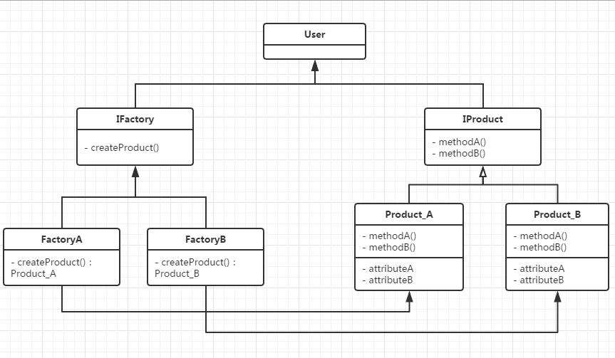
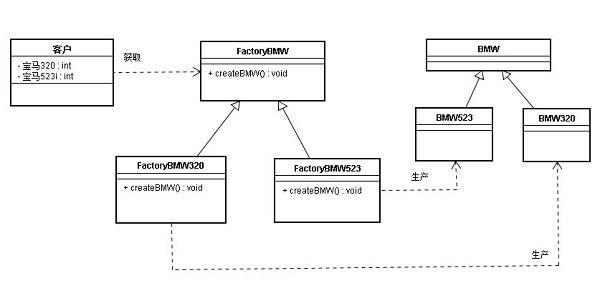

## IOS_FactoryMethodMode

## 工厂方法模式

工厂方法模式：是一种常用的对象创建型设计模式,此模式的核心精神是封装类中不变的部分，提取其中个性化善变的部分为独立类，通过依赖注入以达到解耦、复用和方便后期维护拓展的目的。

工厂方法(Factory Method)模式的意义是定义一个创建产品对象的工厂接口，将实际创建工作推迟到子类当中。核心工厂类不再负责产品的创建，这样核心类成为一个抽象工厂角色，仅负责具体工厂子类必须实现的接口，这样进一步抽象化的好处是使得工厂方法模式可以使系统在不修改具体工厂角色的情况下引进新的产品。

工厂方法模式是简单工厂模式的衍生，解决了许多简单工厂模式的问题。首先完全实现‘开－闭 原则’，实现了可扩展。其次更复杂的层次结构，可以应用于产品结果复杂的场合。

工厂方法模式对简单工厂模式进行了抽象。有一个抽象的Factory类（可以是抽象类和接口），这个类将不再负责具体的产品生产，而是只制定一些规范，具体的生产工作由其子类去完成。在这个模式中，工厂类和产品类往往可以依次对应。即一个抽象工厂对应一个抽象产品，一个具体工厂对应一个具体产品，这个具体的工厂就负责生产对应的产品。

工厂方法模式(Factory Method pattern)是最典型的模板方法模式(Template Method pattern)应用。

## 类型

创建模式

## 结构图

#### 图1

#### 图2

## 角色

* 抽象工厂角色（Factory）： 这是工厂方法模式的核心，它与应用程序无关。是具体工厂角色必须实现的接口或者必须继承的父类。一般由抽象类或者接口来实现。 

* 具体工厂角色（Concrete Factory）：它含有和具体业务逻辑有关的代码。由应用程序调用以创建对应的具体产品的对象。 

* 抽象产品角色（Product）：它是具体产品继承的父类或者是实现的接口。一般由抽象类或者接口来实现。 

* 具体产品角色（Concrete Product）：具体工厂角色所创建的对象就是此角色的实例。由具体的类来实现。

## 适用场景

1. 当一个类不知道它所需要的对象的类时，在工厂方法模式中，客户端不需要知道具体产品类的类名，只需要知道所对应的工厂即可。

2. 当一个类希望通过其子类来指定创建对象时，在工厂方法模式中，对于抽象工厂类只需要提供一个创建产品的接口，而由其子类来确定具体要创建的对象，利用面向对象的多态性和里氏代换原则，在程序运行时，子类对象将覆盖父类对象，从而使得系统更容易扩展。

3. 将创建对象的任务委托给多个工厂子类中的某一个，客户端在使用时可以无须关心是哪一个工厂子类创建产品子类，需要时再动态指定，可将具体工厂类的类名存储在配置文件或数据库中。

4. 客户程序使用的对象存在变动的可能，或者根本就不知道使用哪一个具体的对象。

## 优缺点

#### 优点

1. 更符合开-闭原则，新增一种产品时，只需要增加相应的具体产品类和相应的工厂子类即可。

2. 符合单一职责原则，每个具体工厂类只负责创建对应的产品。

3. 不使用静态工厂方法，可以形成基于继承的等级结构。

#### 缺点

1. 添加新产品时，除了增加新产品类外，还要提供与之对应的具体工厂类，系统类的个数将成对增加，在一定程度上增加了系统的复杂度；同时，有更多的类需要编译和运行，会给系统带来一些额外的开销。

2. 由于考虑到系统的可扩展性，需要引入抽象层，在客户端代码中均使用抽象层进行定义，增加了系统的抽象性和理解难度，且在实现时可能需要用到DOM、反射等技术，增加了系统的实现难度。

3. 虽然保证了工厂方法内的对修改关闭，但对于使用工厂方法的类，如果要更换另外一种产品，仍然需要修改实例化的具体工厂类；

4. 一个具体工厂只能创建一种具体产品

## 总结

工厂模式可以说是简单工厂模式的进一步抽象和拓展，在保留了简单工厂的封装优点的同时，让扩展变得简单，让继承变得可行，增加了多态性的体现。工厂方法模式仿佛已经很完美的对对象的创建进行了包装，使得客户程序中仅仅处理抽象产品角色提供的接口。

当有新的产品产生时，只要按照抽象产品角色、抽象工厂角色提供的合同来生成，那么就可以被客户使用，而不必去修改任何已有的代码。可以看出工厂角色的结构也是符合开闭原则的！

## 参考

[工厂方法模式（Factory Method）-最易懂的设计模式解析](https://blog.csdn.net/carson_ho/article/details/52343584)

[JAVA设计模式之工厂模式(简单工厂模式+工厂方法模式)](https://blog.csdn.net/jason0539/article/details/23020989)

[设计模式（一）工厂模式Factory（创建型）](https://blog.csdn.net/hguisu/article/details/7505909)

[工厂方法模式](https://baike.baidu.com/item/%E5%B7%A5%E5%8E%82%E6%96%B9%E6%B3%95%E6%A8%A1%E5%BC%8F/2361103?fr=aladdin)

[工厂模式](https://baike.baidu.com/item/%E5%B7%A5%E5%8E%82%E6%A8%A1%E5%BC%8F/9852061?fr=aladdin)

[设计模式之工厂方法模式](https://www.cnblogs.com/chenxkang/p/6689631.html)
