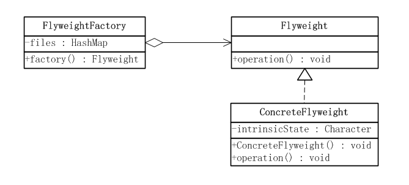
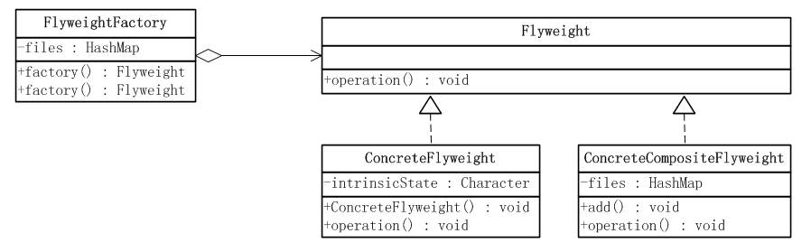

## IOS_FlyweightMode

## 享元模式

享元模式：享元模式以共享的方式高效地支持大量的细粒度对象。

它使用共享物件，用来尽可能减少内存使用量以及分享资讯给尽可能多的相似物件；它适合用于只是因重复而导致使用无法令人接受的大量内存的大量物件。通常物件中的部分状态是可以分享。常见做法是把它们放在外部数据结构，当需要使用时再将它们传递给享元。在有大量对象时，有可能会造成内存溢出，我们把其中共同的部分抽象出来，如果有相同的业务请求，直接返回在内存中已有的对象，避免重新创建。

也就是说在一个系统中如果有多个相同的对象，那么只共享一份就可以了，不必每个都去实例化一个对象。比如说一个文本系统，每个字母定一个对象，那么大小写字母一共就是52个，那么就要定义52个对象。如果有一个1M的文本，那么字母是何其的多，如果每个字母都定义一个对象那么内存早就爆了。那么如果要是每个字母都共享一个对象，那么就大大节约了资源。

## 类型

结构模式

## 享元模式状态

享元模式采用一个共享来避免大量拥有相同内容对象的开销。这种开销最常见、最直观的就是内存的损耗。享元对象能做到共享的关键是区分内蕴状态(Internal State)和外蕴状态(External State)。

* 一个内蕴状态是存储在享元对象内部的，并且是不会随环境的改变而有所不同。因此，一个享元可以具有内蕴状态并可以共享。

* 一个外蕴状态是随环境的改变而改变的、不可以共享的。享元对象的外蕴状态必须由客户端保存，并在享元对象被创建之后，在需要使用的时候再传入到享元对象内部。外蕴状态不可以影响享元对象的内蕴状态，它们是相互独立的。

## 享元模式形式

* 单纯享元模式　

* 复合享元模式

## 结构图

#### 单纯享元模式

#### 复合享元模式

## 单纯享元模式

在单纯的享元模式中，所有的享元对象都是可以共享的。

所有的内蕴状态在对象创建之后，就不会再改变了。

如果一个享元对象有外蕴状态的话，所有的外部状态都必须存储在客户端，在使用享元对象时，再由客户端传入享元对象。

客户端不可以直接将具体享元类实例化，而必须通过一个工厂对象，利用享元工厂角色类一个factory()方法得到享元对象。一般而言，享元工厂对象在整个系统中只有一个，因此也可以使用单例模式。当客户端需要单纯享元对象的时候，需要调用享元工厂的factory()方法，并传入所需的单纯享元对象的内蕴状态，由工厂方法产生所需要的享元对象。

### 单纯享元模式角色

* 抽象享元角色(FlyWeight)：定义出具体享元角色要实现的方法，通过这个接口可以接收并作用于外部状态。通过这个接口传入外部的状态，在享元对象的方法处理中可能会使用这些外部状态数据。

* 具体享元角色(ConcreteFlyWeight)：实现抽象享元角色所规定出的接口。如果有内蕴状态的话，必须负责为内蕴状态提供存储空间。

* 享元工厂(FlyweightFactory)角色：本角色负责创建和管理享元角色。本角色必须保证享元对象可以被系统适当地共享。当一个客户端对象调用一个享元对象的时候，享元工厂角色会检查系统中是否已经有一个符合要求的享元对象。如果已经有了，享元工厂角色就应当提供这个已有的享元对象；如果系统中没有一个适当的享元对象的话，享元工厂角色就应当创建一个合适的享元对象。

## 复合享元模式

在单纯享元模式中，所有的享元对象都是单纯享元对象，也就是说都是可以直接共享的。还有一种较为复杂的情况，将一些单纯享元使用合成模式加以复合，形成复合享元对象。这样的复合享元对象本身不能共享，但是它们可以分解成单纯享元对象，而后者则可以共享。

复合享元对象是由单纯享元对象通过复合而成的，因此它提供了add()这样的聚集管理方法。由于一个复合享元对象具有不同的聚集元素，这些聚集元素在复合享元对象被创建之后加入，这本身就意味着复合享元对象的状态是会改变的，因此复合享元对象是不能共享的。

复合享元角色实现了抽象享元角色所规定的接口，也就是operation()方法，这个方法有一个参数，代表复合享元对象的外蕴状态。一个复合享元对象的所有单纯享元对象元素的外蕴状态都是与复合享元对象的外蕴状态相等的；而一个复合享元对象所含有的单纯享元对象的内蕴状态一般是不相等的，不然就没有使用价值了。

享元工厂角色提供两种不同的方法，一种用于提供单纯享元对象，另一种用于提供复合享元对象。

一个复合享元对象的所有单纯享元对象元素的外蕴状态都是与复合享元对象的外蕴状态相等的。

一个复合享元对象所含有的单纯享元对象的内蕴状态一般是不相等的。

单纯享元对象是可以共享的。即使用相同的对象state通过工厂分别两次创建出的对象是同一个对象。

### 复合享元模式角色

* 抽象享元(Flyweight)角色：给出一个抽象接口，以规定出所有具体享元角色需要实现的方法。是具体享元类的超类或接口，通过该接口Flyweight可以接受并作用于外部状态。通过该接口可以传入外部的状态，在享元对象的方法处理中可能会使用这些外部的数据。

* 具体享元(ConcreteFlyweight)角色：具体的享元实现对象，指定内部状态，必须是共享的。实现抽象享元角色所规定出的接口。如果有内蕴状态的话，必须负责为内蕴状态提供存储空间。

* 复合享元(ConcreteCompositeFlyweight)角色：复合享元角色所代表的对象是不可以共享的，但是一个复合享元对象可以分解成为多个本身是单纯享元对象的组合。复合享元角色又称作不可共享的享元对象。

* 享元工厂(FlyweightFactory)角色：本角色负责创建和管理享元角色。本角色必须保证享元对象可以被系统适当地共享。当一个客户端对象调用一个享元对象的时候，享元工厂角色会检查系统中是否已经有一个符合要求的享元对象。如果已经有了，享元工厂角色就应当提供这个已有的享元对象；如果系统中没有一个适当的享元对象的话，享元工厂角色就应当创建一个合适的享元对象。

## 优缺点

#### 优点

1. 享元模式的优点在于它能够极大的减少系统中对象的个数。

2. 享元模式的外部状态相对独立，而且不会影响其内部状态，从而使得享元对象可以在不同的环境中被共享。

#### 缺点

1. 享元模式使得系统更加复杂。为了使对象可以共享，需要将一些状态外部化，这使得程序的逻辑复杂化。

2. 为了使对象可以共享，享元模式需要将享元对象的状态外部化，而读取外部状态使得运行时间变长。 

## 使用场景

1. 一个系统有大量相同或者相似的对象，由于这类对象的大量使用，造成内存的大量耗费。

2. 对象的大部分状态都可以外部化，可以将这些外部状态传入对象中(细粒度对象).

3. 使用享元模式需要维护一个存储享元对象的享元池，而这需要耗费资源。因此，应当在多次重复使用享元对象时才值得使用享元模式。

## 总结

 1. 享元模式可以极大地减少系统中对象的数量。但是它可能会引起系统的逻辑更加复杂化。
 
 2. 享元模式的核心在于享元工厂，它主要用来确保合理地共享享元对象。

 3. 内部状态为不变共享部分，存储于享元享元对象内部，而外部状态是可变部分，它应当由客户端来负责。

## 参考

[《JAVA与模式》之享元模式](http://www.cnblogs.com/java-my-life/archive/2012/04/26/2468499.html)

[JAVA设计模式之享元模式](https://blog.csdn.net/jason0539/article/details/22908915)

[Java设计模式——享元模式](https://blog.csdn.net/lemon_tree12138/article/details/51241598) 

[深入理解享元模式](https://blog.csdn.net/justloveyou_/article/details/55045638)

[设计模式——享元模式详解](https://blog.csdn.net/seu_calvin/article/details/52858135)

[设计模式12---享元模式（Flyweight Pattern）](https://www.cnblogs.com/linghu-java/p/5728120.html)