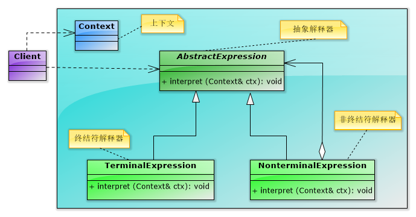
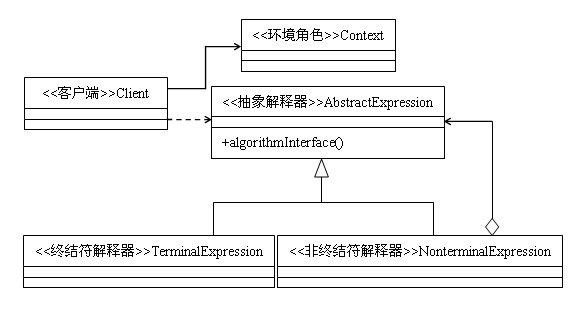

## IOS_InterpreterMode

## 解释器模式
解释器模式：给定一个语言，定义它的文法的一种表示，并定义一个解释器，这个解释器使用该表示来解释语言中的句子。

* 文法：即语法规则。在解释器模式中每一个语法都将对应一个解释器对象，用来处理相应的语法规则。它对于扩展、改变文法以及增加新的文法规则都很方便。

* 解释器模式描述了如何为简单的语言定义一个文法，如何在该语言中表示一个句子，以及如何解释这些句子。
　　
* 在解释器模式中可以通过一种称之为抽象语法树(Abstract Syntax Tree, AST)的图形方式来直观地表示语言的构成，每一棵抽象语法树对应一个语言实例

## 类型

行为模式

## 结构图

#### 图1

#### 图2

## 角色

* 抽象解释器（AbstractExpression）：定义解释器的接口，约定解释器的解释操作。其中的Interpret接口，正如其名字那样，它是专门用来解释该解释器所要实现的功能。（如加法解释器中的Interpret接口就是完成两个操作数的相加功能）。

声明一个所有具体表达式都要实现的抽象接口（或者抽象类），接口中主要是一个interpret()方法，称为解释操作。具体解释任务由它的各个实现类来完成，具体的解释器分别由终结符解释器TerminalExpression和非终结符解释器NonterminalExpression完成。

* 终结符表达式（TerminalExpression）：终结符解释器，用来实现语法规则中和终结符相关的操作，不再包含其他的解释器，如果用组合模式来构建抽象语法树的话，就相当于组合模式中的叶子对象，可以有多种终结符解释器。

实现与文法中的元素相关联的解释操作，通常一个解释器模式中只有一个终结符表达式，但有多个实例，对应不同的终结符。终结符一半是文法中的运算单元，比如有一个简单的公式R=R1+R2，在里面R1和R2就是终结符，对应的解析R1和R2的解释器就是终结符表达式。

* 非终结符表达式（NonterminalExpression）：非终结符解释器，用来实现语法规则中非终结符相关的操作，通常一个解释器对应一个语法规则，可以包含其他解释器，如果用组合模式构建抽象语法树的话，就相当于组合模式中的组合对象。可以有多种非终结符解释器。

文法中的每条规则对应于一个非终结符表达式，非终结符表达式一般是文法中的运算符或者其他关键字，比如公式R=R1+R2中，+就是非终结符，解析+的解释器就是一个非终结符表达式。非终结符表达式根据逻辑的复杂程度而增加，原则上每个文法规则都对应一个非终结符表达式。

* 环境角色（Context）：上下文，通常包含各个解释器需要的数据或是公共的功能。这个Context在解释器模式中起着非常重要的作用。一般用来传递被所有解释器共享的数据，后面的解释器可以从这里获取这些值。

这个角色的任务一般是用来存放文法中各个终结符所对应的具体值，比如R=R1+R2，我们给R1赋值100，给R2赋值200。这些信息需要存放到环境角色中，很多情况下我们使用键值对容器（NSDictionary、Map）来充当环境角色就足够了。

## 优缺点

#### 优点

1. 可扩展性比较好，灵活。由于解释器采用类来描述语法规则，因此可以通过继承等机制创建相应的解释器对象，在创建抽象语法树的时候使用这个新的解释器对象就可以了。修改语法规则只需要修改相应的非终结符就可以了，若扩展语法，只需要增加非终结符类就可以了。

2. 易于实现简单文法。在解释器模式中，一条语法规则用一个解释器对象来解释执行。对于解释器的实现来讲，功能就变得比较简单，只需要考虑这一条语法规则的实现就可以了，其他的都不用管。

3. 增加新的解释表达式较为方便。如果用户需要增加新的解释表达式只需要对应增加一个新的终结符表达式或非终结符表达式类，原有表达式类代码无须修改，符合“开闭原则”。

#### 缺点

1. 执行效率较低。由于在解释器模式中使用了大量的循环和递归调用，因此在解释较为复杂的句子时其速度很慢，而且代码的调试过程也比较麻烦。

2. 对于复杂文法难以维护。在解释器模式中，每一条规则至少需要定义一个类，因此如果一个语言包含太多文法规则，类的个数将会急剧增加，导致系统难以管理和维护，此时可以考虑使用语法分析程序等方式来取代解释器模式。

## 适用场景

1. 有一个简单的语法规则，比如一个sql语句，如果我们需要根据sql语句进行rm转换，就可以使用解释器模式来对语句进行解释。

2. 一些重复发生的问题，比如加减乘除四则运算，但是公式每次都不同，有时是a + b - c * d，有时是 a * b + c - d，等等等等个，公式千变万化，但是都是由加减乘除四个非终结符来连接的，这时我们就可以使用解释器模式。

3. 当一个语言需要解释执行，并可以将该语言中的句子表示为一个抽象语法树的时候，可以考虑使用解释器模式（如XML文档解释、正则表达式等领域）

## 参考

[23种设计模式（14）：解释器模式](https://blog.csdn.net/zhengzhb/article/details/7666020)

[第17章 行为型模式—解释器模式](https://www.cnblogs.com/5iedu/p/5595153.html)

[设计模式(行为型)之解释器模式(Interpreter Pattern)](https://blog.csdn.net/yanbober/article/details/45537601)

[Java设计模式之解释器模式](https://blog.csdn.net/wbwjx/article/details/52456114)

[设计模式读书笔记-----解释器模式](https://www.cnblogs.com/chenssy/p/3346427.html)

[解释器模式](https://www.jianshu.com/p/c138a1d2be5e)

[解释器模式](http://www.runoob.com/design-pattern/interpreter-pattern.html)