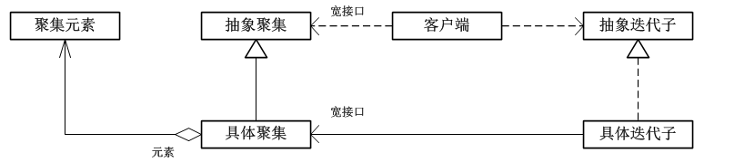
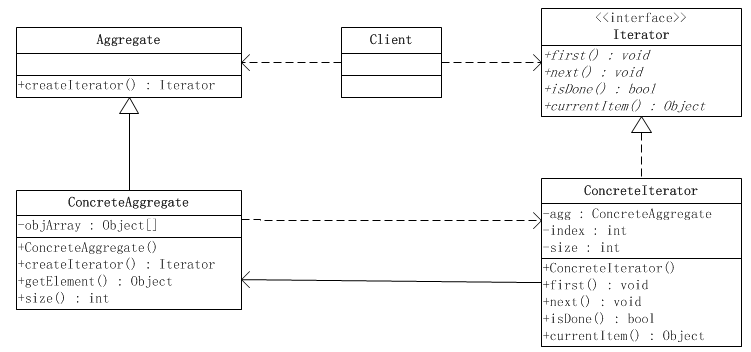
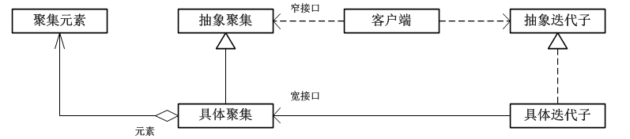
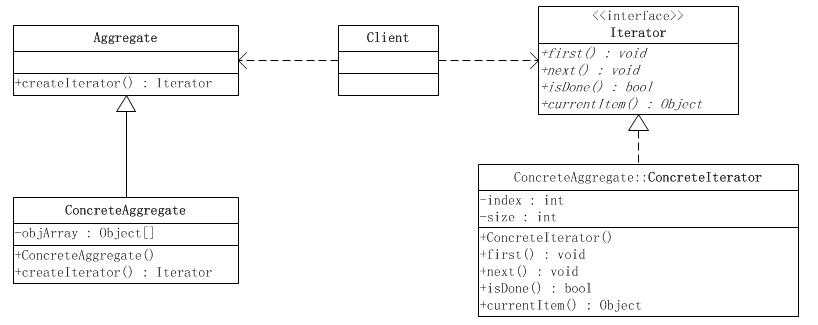

## IOS_IteratorMode

## 迭代子模式（迭代器模式、游标模式）

迭代子模式：迭代子模式可以顺序地访问一个聚集中的元素而不必暴漏聚集的内部表象。迭代子(Iterator)模式又叫游标(Cursor)模式，是对象的行为模式。

在软件构建过程中，集合对象内部结构常常变化各异，但对于这些集合对象，我们希望在不暴露其内部结构的同时，可以让外部客户代码透明地访问其中包含的元素；同时这种“透明遍历”也为同一种算法在多种集合对象上进行操作提供了可能。

使用面向对象技术将这种遍历机制抽象为“迭代器对象”为“应对变化中的集合对象”提供了一种优雅的方式。

## 类型

行为模式

## 聚焦

聚焦（Aggregate）：多个对象聚在一起形成的总体称之为聚集(Aggregate)，聚集对象是能够包容一组对象的容器对象。聚集依赖于聚集结构的抽象化，具有复杂化和多样性。数组就是最基本的聚集，也是其他的聚集对象的设计基础。

聚集对象是实现了共同的集合（Collection）接口的对象，聚集对象必须提供适当的方法，允许客户端按照一个线性顺序遍历所有元素对象 ，把元素对象提取出来或者删除掉等。一个使用聚集的系统必然会使用这些方法操作聚集对象，因而在使用聚集的系统演化过程中，会出现下面两类情况。

1. 迭代逻辑没有改变，但是需要将一种聚集对象换成另一种聚集，因为不同的聚集具有不同的遍历接口，所以需要修改客户端代码，以便将已有的迭代调用换成新聚集对象所要求的接口。

2. 聚集不改变，但是迭代方式需要改变，比如原来只需要读取元素和删除元素，但现在需要增加新的；或者原来的迭代仅仅遍历所有的元素，而现在则需要对元素加以过滤等。这时就只好修改聚集对象，修改已有的遍历方法，或者增加新的方法。

出现这种情况是因为所涉及的聚集设计不符合“开-闭”原则，也就是因为没有将不变的结构从系统中抽象出来，与可变成份分割，并将可变部分的各种实现封装起来。一个聪明的做法无疑是应当使用更加抽象的处理方法，使得在进行迭代时，客户端根本无需知道所使用的聚集是哪个类型；而当客户端需要使用全新的迭代逻辑时，只需要引进一个新的迭代子对象即可，根本无需修改聚集对象本身。

迭代子模式模式便是这样的一个抽象化的概念，这一模式之所以能够做到这一点，是因为它将迭代逻辑封装到一个独立的迭代子对象汇总，从而与聚集本身分隔开。迭代子对象是对遍历的抽象化，不同的聚集对象可以提供相同的迭代子对象，从而使客户端无需知道聚集的低层结构，一个聚集可以提供多个不同的迭代子对象，从而使得遍历逻辑的变化不会影响到聚集对象本身。

## 实现方式

迭代子模式有两种实现方式，分别是白箱聚集与外禀迭代子和黑箱聚集与内禀迭代子。

### 白箱聚集与外禀迭代子

如果一个聚集的接口提供了可以用来修改聚集元素的方法，这个接口就是所谓的宽接口。

如果聚集对象为所有对象提供同一个接口，也就是宽接口的话，当然会满足迭代子模式对迭代子对象的要求。但是，这样会破坏对聚集对象的封装。这种提供宽接口的聚集叫做白箱聚集。

由于聚集自己实现迭代逻辑，并向外部提供适当的接口，使得迭代子可以从外部控制聚集元素的迭代过程。这样一来迭代子所控制的仅仅是一个游标而已，这种迭代子叫做游标迭代子（Cursor Iterator）。由于迭代子是在聚集结构之外的，因此这样的迭代子又叫做外禀迭代子（Extrinsic Iterator）。

一个白箱聚集向外界提供访问自己内部元素的接口（称作遍历方法或者Traversing Method），从而使外禀迭代子可以通过聚集的遍历方法实现迭代功能。

因为迭代的逻辑是由聚集对象本身提供的，所以这样的外禀迭代子角色往往仅仅保持迭代的游标位置。

#### 意义
一个常常会问的问题是：既然白箱聚集已经向外界提供了遍历方法，客户端已经可以自行进行迭代了，为什么还要应用迭代子模式，并创建一个迭代子对象进行迭代呢？

客户端当然可以自行进行迭代，不一定非得需要一个迭代子对象。但是，迭代子对象和迭代模式会将迭代过程抽象化，将作为迭代消费者的客户端与迭代负责人的迭代子责任分隔开，使得两者可以独立的演化。在聚集对象的种类发生变化，或者迭代的方法发生改变时，迭代子作为一个中介层可以吸收变化的因素，而避免修改客户端或者聚集本身。

此外，如果系统需要同时针对几个不同的聚集对象进行迭代，而这些聚集对象所提供的遍历方法有所不同时，使用迭代子模式和一个外界的迭代子对象是有意义的。具有同一迭代接口的不同迭代子对象处理具有不同遍历接口的聚集对象，使得系统可以使用一个统一的迭代接口进行所有的迭代。

### 黑箱聚集与内禀迭代子

如果一个聚集的接口没有提供修改聚集元素的方法，这样的接口就是所谓的窄接口。

聚集对象为迭代子对象提供一个宽接口，而为其他对象提供一个窄接口。换言之，聚集对象的内部结构应当对迭代子对象适当公开，以便迭代子对象能够对聚集对象有足够的了解，从而可以进行迭代操作。但是，聚集对象应当避免向其他的对象提供这些方法，因为其他对象应当经过迭代子对象进行这些工作，而不是直接操控聚集对象。

实现双重接口的办法就是将迭代子类设计成聚集类的内部成员类（如java语言中）。这样迭代子对象将可以像聚集对象的内部成员一样访问聚集对象的内部结构。这种同时保证聚集对象的封装和迭代子功能的实现的方案叫做黑箱实现方案。

由于迭代子是聚集的内部类，迭代子可以自由访问聚集的元素，所以迭代子可以自行实现迭代功能并控制对聚集元素的迭代逻辑。由于迭代子是在聚集的结构之内定义的，因此这样的迭代子又叫做内禀迭代子（Intrinsic Iterator）。

## 结构图

### 白箱聚集与外禀迭代子

#### 图1

#### 图2

### 黑箱聚集与内禀迭代子

#### 图1

#### 图2

## 角色

* 抽象迭代子(Iterator)角色：此抽象角色定义出遍历元素所需的接口。

* 具体迭代子(ConcreteIterator)角色：此角色实现了Iterator接口，并保持迭代过程中的游标位置。

* 聚集(Aggregate)角色：此抽象角色给出创建迭代子(Iterator)对象的接口。

* 具体聚集(ConcreteAggregate)角色：实现了创建迭代子(Iterator)对象的接口，返回一个合适的具体迭代子实例。

客户端(Client)持有对聚集及其迭代子对象的引用，调用迭代子对象的迭代接口，也有可能通过迭代子操作聚集元素的增加和删除。

## 适用场景

1. 访问一个聚合对象的内容而无需暴露它的内部表示

2. 支持对聚合对象的多种遍历

3. 为遍历不同的聚合结构提供一个统一的接口

## 优缺点

#### 优点

1. 迭代子模式简化了聚集的接口。迭代子具备了一个遍历接口，这样聚集的接口就不必具备遍历接口。

2. 每一个聚集对象都可以有一个或多个迭代子对象，每一个迭代子的迭代状态可以是彼此独立的。因此，一个聚集对象可以同时有几个迭代在进行之中。

3. 由于遍历算法被封装在迭代子角色里面，因此迭代的算法可以独立于聚集角色变化。

4. 在迭代器模式中，增加新的聚合类和迭代器类都很方便，无须修改原有代码。

#### 缺点

* 由于迭代器模式将存储数据和遍历数据的职责分离，增加新的聚合类需要对应增加新的迭代器类，类的个数成对增加，这在一定程度上增加了系统的复杂性。

## 拓展

### 主动迭代子和被动迭代子

主动迭代子和被动迭代子又称作外部迭代子和内部迭代子。

所谓主动（外部）迭代子，指的是由客户端来控制迭代下一个元素的步骤，客户端会明显调用迭代子的next等迭代方法，在遍历过程中向前进行。

所谓被动（内部）迭代子，指的是由迭代子自己来控制迭代下一个元素的步骤。因此，如果想要在迭代的过程中完成工作的话，客户端就需要把操作传递给迭代子，迭代子在迭代的时候会在每个元素上执行这个操作，类似于回调机制。

总体来说外部迭代器比内部迭代器要灵活一些，因此我们常见的实现多属于主动迭代子。

### 静态迭代子和动态迭代子

* 静态迭代子由聚集对象创建，并持有聚集对象的一份快照(snapshot)，在产生后这个快照的内容就不再变化。客户端可以继续修改原聚集的内容，但是迭代子对象不会反映出聚集的新变化。

静态迭代子的好处是它的安全性和简易性，换言之，静态迭代子易于实现，不容易出现错误。但是由于静态迭代子将原聚集复制了一份，因此它的短处是对时间和内存资源的消耗。

* 动态迭代子则与静态迭代子完全相反，在迭代子被产生之后，迭代子保持着对聚集元素的引用，因此，任何对原聚集内容的修改都会在迭代子对象上反映出来。

## 总结

迭代器模式是与集合共生共死的，一般来说，我们只要实现一个集合，就需要同时提供这个集合的迭代器，就像java中的Collection，List、Set、Map等或OC中的NSArray、NSSet，NSDictionary等，这些集合都有自己的迭代器。假如我们要实现一个这样的新的容器，当然也需要引入迭代器模式，给我们的容器实现一个迭代器。

在OC中只能实现白箱聚集与外禀迭代子方式。

## 参考

[《JAVA与模式》之迭代子模式](https://www.cnblogs.com/java-my-life/archive/2012/05/22/2511506.html)

[Java设计模式之迭代子模式](https://blog.csdn.net/jason0539/article/details/45070441)

[Java设计模式系列之迭代器模式](https://www.cnblogs.com/ysw-go/p/5384516.html)
