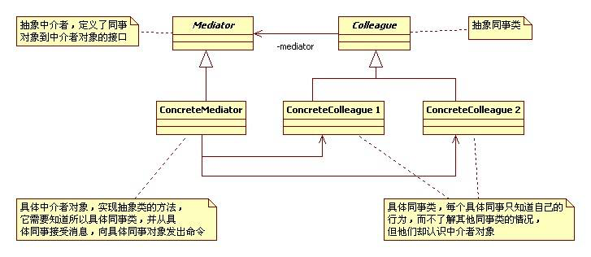
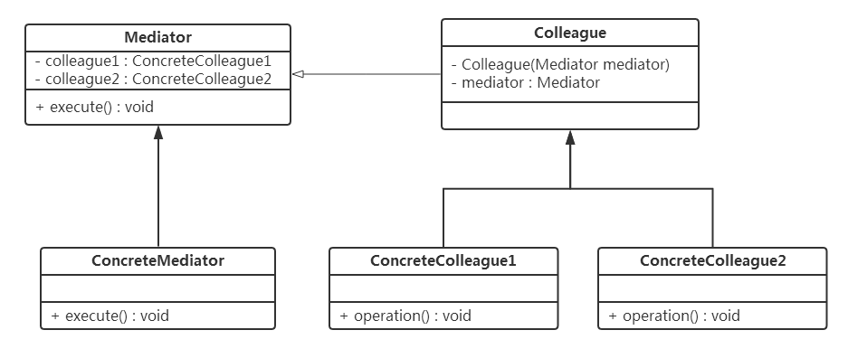

## IOS_MediatorMode

## 中介者模式 （调停者模式）

中介者模式（调停者模式）：用一个中介者对象封装一系列的对象交互，中介者使各对象不需要显示地相互作用，从而使耦合松散，而且可以独立地改变它们之间的交互。

中介者模式主要适用在网状结构的对象关系中，将它们之间关系变为星状结构，所有对象都只跟中介者对象进行通讯，相互之间没有直接关系，通过中介者类来集中控制对象的交互关系。

## 类型

行为模式

## 结构图

#### 图1

#### 图2

## 角色

* 抽象中介者（Mediator）：定义同事对象到中介者对象的接口，主要方法是一个或多个事件方法。一般包括一个或几个抽象的事件方法，并由子类去实现。

* 具体中介者（ConcreteMediator）：实现了抽象中介者所声明的事件方法。具体中介者知晓所有的具体同事类，并负责具体的协调各同事对象的交互关系。从抽象中介者继承而来，实现抽象中介者中定义的事件方法。从一个同事类接收消息，然后通过消息影响其他同时类。

* 抽象同事类（Colleague）：定义中介者角色到同事角色之间的接口，同事对象只知道有中介者不知道是否有其它同事。

* 具体同事类（ConcreteColleague）：具体同事类角色继承抽象同事类，实现自己的业务，在需要与其他同事通信的时候，就与持有的中介者通信，中介者会负责与其他的同事交互。

## 适用场景

* 一组定义良好的对象，现在要进行复杂的相互通信。

* 想通过一个中间类来封装多个类中的行为，而又不想生成太多的子类。

* 系统中存在对象之间的多对多的关系。

## 优缺点

#### 优点

1. 减少类之间的依赖，把原有的一对多的依赖变成了一对一的依赖，同事类只依赖中介者，减少了类的依赖，当然也降低了类间的耦合。

2. 使用中介者模式可以将对象的行为和协作进行抽象，能够比较灵活的处理对象间的相互作用。

3. 使用中介者模式可以将对象间多对多的关联转变为一对多的关联，使对象间的关系易于理解和维护。

#### 缺点

1. 中介者模式把业务流程和协调都写在中介者，当同事类越多，中介者的业务就越复杂，造成不好管理的弊端。

2. 如果要增减同事类，必须得修改抽象中介者角色和具体中介者角色类。

3. 中介者角色承担了较多的责任，所以一旦这个中介者对象出现了问题，整个系统将会受到重大的影响。

## 总结

在面向对象编程中，一个类必然会与其他的类发生依赖关系，完全独立的类是没有意义的。一个类同时依赖多个类的情况也相当普遍，既然存在这样的情况，说明，一对多的依赖关系有它的合理性，适当的使用中介者模式可以使原本凌乱的对象关系清晰，但是如果滥用，则可能会带来反的效果。一般来说，只有对于那种同事类之间是网状结构的关系，才会考虑使用中介者模式。可以将网状结构变为星状结构，使同事类之间的关系变的清晰一些。

中介者模式是一种比较常用的模式，也是一种比较容易被滥用的模式。对于大多数的情况，同事类之间的关系不会复杂到混乱不堪的网状结构，因此，大多数情况下，将对象间的依赖关系封装的同事类内部就可以的，没有必要非引入中介者模式。滥用中介者模式，只会让事情变的更复杂。 

## 参考

[Java 设计模式之中介者模式](https://blog.csdn.net/jason0539/article/details/45216585)

[设计模式学习之中介者模式](https://blog.csdn.net/u012124438/article/details/70474166)

[设计模式——中介者模式](https://baijiahao.baidu.com/s?id=1591643459849634142&wfr=spider&for=pc)

[设计模式之中介者模式---Mediator Pattern](https://baijiahao.baidu.com/s?id=1591643459849634142&wfr=spider&for=pc)

[设计模式之中介者模式](https://www.cnblogs.com/snaildev/p/7686908.html)
