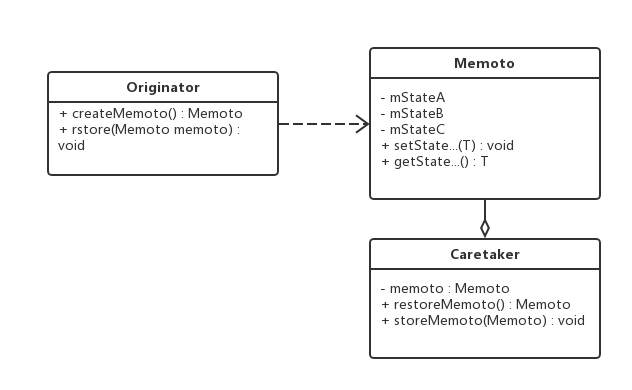
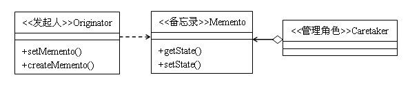

## IOS_MementoMode

## 备忘录模式
备忘录模式（Memento Pattern）：在不破坏封闭的前提下，捕获一个对象的内部状态，并在该对象之外保存这个状态。这样以后就可将该对象恢复到原先保存的状态。又叫快照模式（Snapshot Pattern）或Token模式。

备忘录主要用于对象状态的还原。对于对象经过一系列操作后的还原我们通常可以采取如下三种策略：

1. 逆向操作。我们可以记录对对象的操作序列，当需要还原对象时逆序执行操作序列中记录的操作的逆操作；该策略适用于已实现或易于实现的对象操作。如插入与删除、加运算与减运算等。

2. 正向重做。我们可以记录对对象的操作序列及对象的原始状态，当需要还原对象时从原始状态开始重做操作序列上的操作，直到要还原状态的操作的上一个操作。该策略适用于无逆向操作或逆向操作难于实现且操作序列较短的场景。如计算MD5等。

3. 状态还原。我们可以记录每个操作后对象的状态，在需要还原时直接还原对象执行操作前的状态。该策略适用于无逆向操作或逆向操作难于实现且正向重做的CPU损耗与记录操作内存损耗大于记录对象状态的内存损耗的场景。 

不难看出，备忘录正是上面提到的第三种策略的实现。

## 类型

行为模式

## 结构图

#### 图1

#### 图2

## 角色

* 发起人（Originator）：记录当前时刻的内部状态，负责定义哪些属于备份范围的状态，负责创建和恢复备忘录数据。负责创建一个备忘录Memento，用以记录当前时刻自身的内部状态，并可使用备忘录恢复内部状态。Originator可以根据需要决定Memento存储自己的哪些内部状态。

* 备忘录(Memento)：负责存储发起人对象的内部状态，在需要的时候提供发起人需要的内部状态。 可以防止Originator以外的其他对象访问备忘录。备忘录有两个接口：Caretaker只能看到备忘录的窄接口，他只能将备忘录传递给其他对象。Originator却可看到备忘录的宽接口，允许它访问返回到先前状态所需要的所有数据。

* 管理者(Caretaker)：对备忘录进行管理，保存和提供备忘录。不能对备忘录中的内容进行操作和检查。

## 优缺点

#### 优点

1. 当发起人角色中的状态改变时，有可能这是个错误的改变，我们使用备忘录模式就可以把这个错误的改变还原。

2. 备份的状态是保存在发起人角色之外的，这样，发起人角色就不需要对各个备份的状态进行管理。

3. 有时一些发起人对象的内部信息必须保存在发起人对象以外的地方，但是必须要由发起人对象自己读取，这时，使用备忘录模式可以把复杂的发起人内部信息对其他的对象屏蔽起来，从而可以恰当地保持封装的边界。

#### 缺点

备忘录模式都是多状态和多备份的，发起人角色的状态需要存储到备忘录对象中，对资源的消耗是比较严重的。

1. 如果发起人角色的状态需要完整地存储到备忘录对象中，那么在资源消耗上面备忘录对象会很昂贵。

2. 当负责人角色将一个备忘录 存储起来的时候，负责人可能并不知道这个状态会占用多大的存储空间，从而无法提醒用户一个操作是否很昂贵。

3. 当发起人角色的状态改变的时候，有可能这个协议无效。如果状态改变的成功率不高的话，不如采取“假如”协议模式。

## 适用场景

1. 适合功能比较复杂的，但需要维护或记录属性历史的功能。

2. 有需要提供回滚操作的需求，使用备忘录模式非常适合，比如jdbc的事务操作，文本编辑器的Ctrl+Z恢复等。

## 总结

多状态多备份备忘录

通常情况下，对象中需要备份的变量不止一个，需要备份的状态也不止一个，这就是多状态多备份备忘录。实现备忘录的方法很多，备忘录模式有很多变形和处理方式，多数情况下的备忘录模式，是多状态多备份的。其实实现多状态多备份也很简单，最常用的方法是，我们在Memento中增加一个键值对 NSDictionary（Map）容器来存储所有的状态，在Caretaker类中同样使用一个键值对 NSDictionary（Map）容器才存储所有的备份。

## 参考

[23种设计模式（15）：备忘录模式](https://blog.csdn.net/zhengzhb/article/details/7697549)

[JAVA设计模式之：备忘录模式](https://blog.csdn.net/true100/article/details/50561081)

[备忘录模式](https://baike.baidu.com/item/%E5%A4%87%E5%BF%98%E5%BD%95%E6%A8%A1%E5%BC%8F/1430849?fr=aladdin)

[设计模式讲解与代码实践（十九）——备忘录](https://blog.csdn.net/free1985/article/details/78220267)

[VA设计模式学习22——备忘录模式](http://alaric.iteye.com/blog/1931253)

[java设计模式-备忘录模式](https://www.imooc.com/article/15707)
