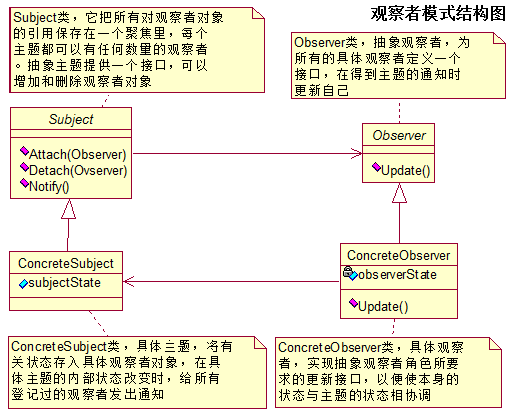
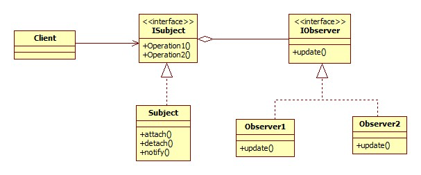
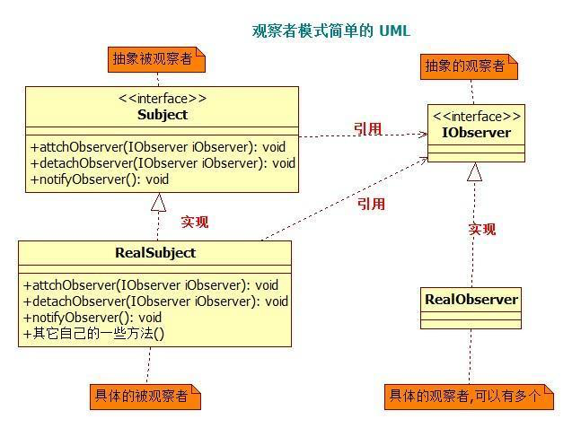

## IOS_ObserverMode

## 观察者模式
观察者模式：在对象之间定义了一对多的依赖，这样一来，当一个对象改变状态，依赖它的对象会收到通知并自动更新。这通常通过呼叫各观察者所提供的方法来实现。此种模式通常被用来实现事件处理系统。

其实就是发布订阅模式，发布者发布信息，订阅者获取信息，订阅了就能收到信息，没订阅就收不到信息。

## 类型

行为模式

## 结构图

#### 图1

#### 图2

#### 图3

## 角色
* 抽象被观察者角色：把所有对观察者对象的引用保存在一个集合中，每个被观察者角色都可以有任意数量的观察者。被观察者提供一个接口，可以增加和删除观察者角色。一般用一个抽象类和接口来实现。

* 抽象观察者角色：为所有具体的观察者定义一个接口，在得到主题的通知时更新自己。

* 具体被观察者角色：在被观察者内部状态改变时，给所有登记过的观察者发出通知。具体被观察者角色通常用一个子类实现。

* 具体观察者角色：该角色实现抽象观察者角色所要求的更新接口，以便使本身的状态与主题的状态相协调。通常用一个子类实现。如果需要，具体观察者角色可以保存一个指向具体主题角色的引用。

## 适用场景
1. 当一个抽象模型有两个方面, 其中一个方面依赖于另一方面。将这二者封装在独立的对象中以使它们可以各自独立地改变和复用。
2. 当对一个对象的改变需要同时改变其它对象, 而不知道具体有多少对象有待改变。
3. 当一个对象必须通知其它对象，而它又不能假定其它对象是谁。换言之, 你不希望这些对象是紧密耦合的。

## 运用示例
1. 有一个微信公众号服务，不定时发布一些消息，关注公众号就可以收到推送消息，取消关注就收不到推送消息。
2. kvo，通知，广播

## 参考
[Java设计模式之观察者模式](https://blog.csdn.net/jason0539/article/details/45055233)

[iOS开发之观察者模式初探](https://www.jianshu.com/p/56d9417c3a04)

[JAVA设计模式之观察者模式](https://www.cnblogs.com/luohanguo/p/7825656.html)
