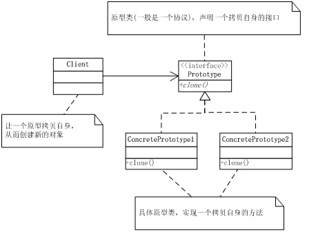

## IOS_PrototypeMode
## 原型模式
原型模式：用原型实例指定创建对象的种类，并通过拷贝这些原型创建新的对象。

## 类型
类型：创建类模式

## 类图

## 作用
原型模式主要用于对象的复制，它的核心是就是类图中的原型类Prototype。

Prototype类需要具备以下两个条件：

1.实现NSCopying协议。在Objective-c语言有一个NSCopying协议，它的作用只有一个，就是在运行时可以安全地在实现了此接口的类上使用copy方法。在oc中，只有实现了这个协议的类才可以被拷贝，否则在运行时会抛出异常。
	
2.重写NSObject类中的copyWithZone方法。oc中，几乎所有类的父类都是NSObject类，NSObject类中有一个copyWithZone方法，作用是返回对象的一个拷贝。

原型模式是一种比较简单的模式，也非常容易理解，实现一个接口，重写一个方法即完成了原型模式。在实际应用中，原型模式很少单独出现。经常与其他模式混用，他的原型类Prototype也常用抽象类来替代。

## 注意

使用原型模式的另一个好处是简化对象的创建，使得创建对象就像我们在编辑文档时的复制粘贴一样简单。

因为以上优点，所以在需要重复地创建相似对象时可以考虑使用原型模式。比如需要在一个循环体内创建对象，假如对象创建过程比较复杂或者循环次数很多的话，使用原型模式不但可以简化创建过程，而且可以使系统的整体性能提高很多。

## 原型模式的注意事项

在使用时要特别注意深拷贝与浅拷贝。

我们使用copyWithZone:(NSZone *)zone方法实现了深复制，通过copy方法(该方法默认调用copyWithZone方法)复制得到prototypeDeepCopy，从输出结果来看，内存地址与prototype是不一样的，另外深复制得到prototypeDeepCopy后，修改prototype的name，对prototypeDeepCopy的name值没有影响，可判断为深复制；

使用直接赋值得到的prototypeShallowCopy，内存地址与prototype一样，只是简单的指针复制，另外从修改了prototype的name值同时也影响了prototypeShallowCopy的name值也可以看出，这种为浅复制。

大家看完这个例子，可能感觉怎么和原型模式的结构图不太一样？实际上是一样的，这里的Prototype类相当于是结构图里面的ConcretePrototype，NSCopying相当于是结构图里面的Prototype。

[参考此博客（IOS设计模式浅析之原型模式(Prototype)）](https://www.cnblogs.com/eagle927183/p/3462439.html)
