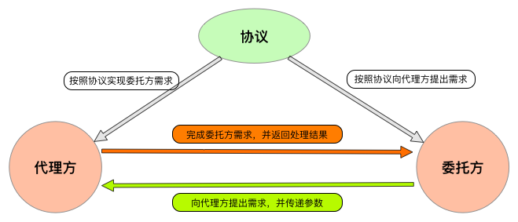

## IOS_ProxyMode

## 代理模式
代理模式：为其他对象提供一种代理以控制对这个对象的访问。在某些情况下，一个对象不适合或者不能直接引用另一个对象，而代理对象可以在客户端和目标对象之间起到中介的作用。

一个是真正的你要访问的对象(目标类)，一个是代理对象,真正对象与代理对象实现同一个接口,先访问代理类再访问真正要访问的对象。

代理模式分为静态代理、动态代理。

静态代理是由程序员创建或工具生成代理类的源码，再编译代理类。所谓静态也就是在程序运行前就已经存在代理类的字节码文件，代理类和委托类的关系在运行前就确定了。

动态代理是在实现阶段不用关心代理类，而在运行阶段才指定哪一个对象。

IOS中代理主要由三部分组成：

* 协议：用来指定代理双方可以做什么，必须做什么。
* 代理：根据指定的协议，完成委托方需要实现的功能。
* 委托：根据指定的协议，指定代理去完成什么功能。

## 类型
结构模式

## 结构图

 
 
## iOS中代理和block的选择
代理和block的选择

在iOS中的回调方法有很多，而代理和block功能更加相似，都是直接进行回调，那我们应该用哪个呢，或者说哪个更好呢？

其实这两种消息传递的方式，没有哪个更好、哪个不好直说....我们应该区分的是在什么情况下应该用什么，用什么更合适！下面我将会简单的介绍一下在不同情况下代理和block的选择：

* 多个消息传递，应该使用delegate。在有多个消息传递时，用delegate实现更合适，看起来也更清晰。block就不太好了，这个时候block反而不便于维护，而且看起来非常臃肿，很别扭。例如UIKit的UITableView中有很多代理如果都换成block实现，我们脑海里想一下这个场景，这里就不用代码写例子了.....那简直看起来不能忍受。
* 一个委托对象的代理属性只能有一个代理对象，如果想要委托对象回调多个代理对象应该用block。(这里主要是针对于对象内部属性不会对block进行引用的情况下，否则再调用同一个方法也会造成重新赋值问题)。当应用于方法回调时，在多个类或多个地方进行回调，这种情况就更佳适合用block的方式了。每调用一次方法就可以在block回调代码块中，进行自己的操作，比代理的方式更佳强大。
* 代理更加面相过程，block则更面向结果。 从设计模式的角度来说，代理更佳面向过程，而block更佳面向结果。例如我们使用NSXMLParserDelegate代理进行XML解析，NSXMLParserDelegate中有很多代理方法，NSXMLParser会不间断调用这些方法将一些转换的参数传递出来，这就是NSXMLParser解析流程，这些通过代理来展现比较合适。而例如一个网络请求回来，就通过success、failure代码块来展示就比较好。
* 从性能上来说，block的性能消耗要略大于delegate，因为block会涉及到栈区向堆区拷贝等操作，时间和空间上的消耗都大于代理。而代理只是定义了一个方法列表，在遵守协议对象的objc_protocol_list中添加一个节点，在运行时向遵守协议的对象发送消息即可。

## 参考
[你真的了解iOS代理设计模式吗？](https://www.jianshu.com/p/2113ffe54b30)
