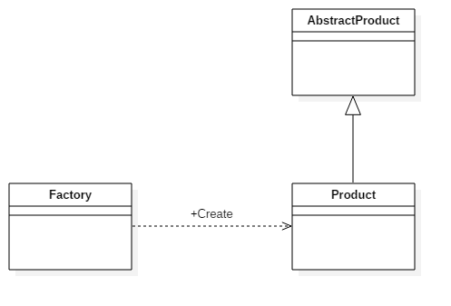

## IOS_SimpleFactoryMode

## 简单工厂模式 （静态工厂模式）

简单工厂模式：又称为静态工厂方法(Static Factory Method)模式，它属于类创建型模式。在简单工厂模式中，可以根据参数的不同返回不同类的实例。简单工厂模式专门定义一个类来负责创建其他类的实例，被创建的实例通常都具有共同的父类。是工厂方法模式的特殊实现。

使用简单工厂模式可以将产品的“消费”和生产完全分开，客户端只需要知道自己需要什么产品，如何来使用产品就可以了，具体的产品生产任务由具体的工厂类来实现。工厂类根据传进来的参数生产具体的产品供消费者使用。这种模式使得更加利于扩展，当有新的产品加入时仅仅需要在工厂中加入新产品的构造就可以了。

## 类型

创建模式

## 结构图

#### 图1

#### 图2

## 角色

* 工厂（Creator）角色：简单工厂模式的核心，它负责实现创建所有实例的内部逻辑。工厂类的创建产品类的方法可以被外界直接调用，创建所需的产品对象。

* 抽象产品（Product）角色：简单工厂模式所创建的所有对象的父类，它负责描述所有实例所共有的公共接口。

* 具体产品（Concrete Product）角色：是简单工厂模式的创建目标，所有创建的对象都是充当这个角色的某个具体类的实例。

## 优缺点

#### 优点

1. 工厂类含有必要的判断逻辑，可以决定在什么时候创建哪一个产品类的实例，客户端可以免除直接创建产品对象的责任，而仅仅“消费”产品；简单工厂模式通过这种做法实现了对责任的分割，它提供了专门的工厂类用于创建对象。

2. 职责单一，实现简单，且实现了客户端代码与具体实现的解耦。

3. 通过引入配置文件，可以在不修改任何客户端代码的情况下更换和增加新的具体产品类，在一定程度上提高了系统的灵活性。

4. 当需要引入新的产品是不需要修改客户端的代码，只需要添加相应的产品类并修改工厂类就可以了，所以说从产品的角度上简单工厂模式是符合“开-闭”原则的。

5. 明确了各自的职责和权利，有利于整个软件体系结构的优化。工厂类是整个模式的关键.包含了必要的逻辑判断,根据外界给定的信息,决定究竟应该创建哪个具体类的对象.

#### 缺点

1. 由于工厂类集中了所有实例的创建逻辑，违反了高内聚责任分配原则，将全部创建逻辑集中到了一个工厂类中；它所能创建的类只能是事先考虑到的，如果需要添加新的类，则就需要改变工厂类了。因此它是违背开放封闭原则的。

2. 使用简单工厂模式将会增加系统中类的个数，在一定程序上增加了系统的复杂度和理解难度。

3. 当系统中的具体产品类不断增多时候，可能会出现要求工厂类根据不同条件创建不同实例的需求．这种对条件的判断和对具体产品类型的判断交错在一起，很难避免模块功能的蔓延，对系统的维护和扩展非常不利。

## 适用场景

1. 工厂类负责创建的对象比较少。

2. 客户只知道传入工厂类的参数，对于如何创建对象（逻辑）不关心。

3. 由于简单工厂很容易违反高内聚责任分配原则，因此一般只在很简单的情况下应用。

## 参考

[设计模式学习笔记-简单工厂模式](https://www.cnblogs.com/wangjq/archive/2012/07/02/2558255.html)

[工厂模式三部曲 - 简单工厂模式](https://www.jianshu.com/p/a523144d8d7a)

[设计模式（一）简单工厂模式](https://blog.csdn.net/xingjiarong/article/details/49999121)

[iOS 三种工厂模式(简单工厂模式、工厂模式、抽象工厂模式)](https://www.jianshu.com/p/847af218b1f0)