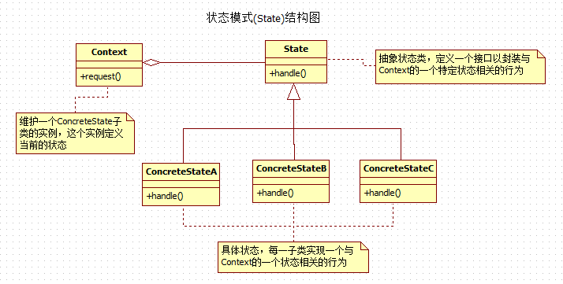
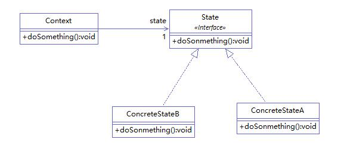

## IOS_StateMode

## 状态模式

状态模式：当一个对象的内在状态改变时允许改变其行为，这个对象看起来像是改变了其类。

状态模式主要解决的是当控制一个对象状态的条件表达式过于复杂时的情况。把状态的判断逻辑转移到表示不同状态的一系列类中，可以把复杂的判断逻辑简化。

状态模式中的行为是由状态决定的，不同的状态有不同的行为，状态模式把对象的行为包装在不同的具体状态对象里，每一个状态对象都有一个共同的抽象状态基类。状态模式的意图是让一个对象在其内部状态改变的时候，其行为也随之改变。

使用状态模式可以将每一个条件分支放入一个独立的类中，这使得你可以根据对象自身的情况将对象的状态作为一个对象，这一对象可以不依赖与其它对象而独立变化，这一对象可以不依赖于其它对象而独立变化，这样通过多态来去除过多的、重复的ifelse语句。

## 类型

行为模式

## 结构图

#### 图1

#### 图2

## 角色

* 环境类（Context）：环境类又称为上下文类，它是拥有多种状态的对象。由于环境类的状态存在多样性且在不同状态下对象的行为有所不同，因此将状态独立出去形成单独的状态类。在环境类中维护一个抽象状态类 State 的实例，这个实例定义当前状态，在具体实现时，它是一个 State 子类的对象。

* 抽象状态类（State）：定义一个接口以封装与环境类的一个特定状态相关的行为，在抽象状态类中声明了各种不同状态对应的方法，而在其子类中实现类这些方法，由于不同状态下对象的行为可能不同，因此在不同子类中方法的实现可能存在不同，相同的方法可以写在抽象状态类中。

* 具体状态类（ConcreteState）：抽象状态类的子类，每一个子类实现一个与环境类的一个状态相关的行为，每一个具体状态类对应环境的一个具体状态，不同的具体状态类其行为有所不同。

## 适用场景
1. 一个对象的行为取决于它的状态，并且它必须在运行时刻根据状态改变它的行为。

2. 一个操作中含有庞大的多分支结构，并且这些分支决定于对象的状态。

## 优缺点

#### 优点

1. 封装了转换规则。

2. 枚举可能的状态，在枚举状态之前需要确定状态种类。

3. 将所有与某个状态有关的行为放到一个类中，并且可以方便地增加新的状态，只需要改变对象状态即可改变对象的行为。

4. 允许状态转换逻辑与状态对象合成一体，而不是某一个巨大的条件语句块。

5. 可以让多个环境对象共享一个状态对象，从而减少系统中对象的个数。

#### 缺点

1. 增加系统类和对象的个数。

2. 状态模式的结构与实现都较为复杂，如果使用不当将导致程序结构和代码的混乱。

3. 状态模式对“开闭原则”的支持并不太好，对于可以切换状态的状态模式，增加新的状态类需要修改那些负责状态转换的源代码，否则无法切换到新增状态；而且修改某个状态类的行为也需修改对应类的源代码。

## 总结

使用状态模式前，客户端外界需要介入改变状态，而状态改变的实现是琐碎或复杂的。

使用状态模式后，客户端外界可以直接使用事件Event实现，根本不必关心该事件导致如何状态变化，这些是由状态机等内部实现。
这是一种Event-condition-State，状态模式封装了condition-State部分。

每个状态形成一个子类，每个状态只关心它的下一个可能状态，从而无形中形成了状态转换的规则。如果新的状态加入，只涉及它的前一个状态修改和定义。

状态模式是让各个状态对象自己知道其下一个处理的对象是谁！即在状态子类编译时在代码上就设定好了！

## 参考

[Java设计模式之状态模式](https://blog.csdn.net/jason0539/article/details/45021055)

[设计模式——状态模式详解](https://blog.csdn.net/seu_calvin/article/details/52779282)

[设计模式—状态模式](https://www.cnblogs.com/nnn123/p/6723729.html)

[【设计模式】策略模式与状态模式](https://www.cnblogs.com/m7777/p/7723879.html)

[设计模式—状态模式](https://www.jianshu.com/p/38429c1f8e8f)