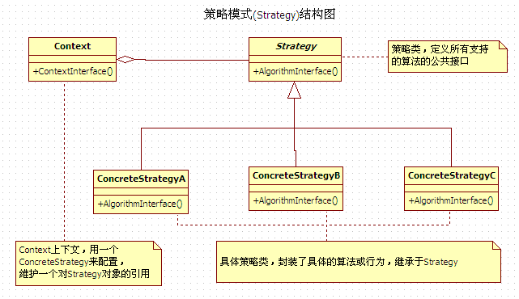

## IOS_StrategeyMode
## 策略模式
策略模式：指有一定行动内容的相对稳定的策略名称。实现某一个功能有多种算法或者策略，我们可以根据环境或者条件的不同选择不同的算法或者策略来完成该功能。如查找、排序等，一种常用的方法是硬编码(Hard Coding)在一个类中，如需要提供多种查找算法，可以将这些算法写到一个类中，在该类中提供多个方法，每一个方法对应一个具体的查找算法；当然也可以将这些查找算法封装在一个统一的方法中，通过if…else…或者case等条件判断语句来进行选择。这两种实现方法我们都可以称之为硬编码，如果需要增加一种新的查找算法，需要修改封装算法类的源代码；更换查找算法，也需要修改客户端调用代码。在这个算法类中封装了大量查找算法，该类代码将较复杂，维护较为困难。如果我们将这些策略包含在客户端，这种做法更不可取，将导致客户端程序庞大而且难以维护，如果存在大量可供选择的算法时问题将变得更加严重。

定义一系列算法，把他们一个个封装起来，并且使他们相互可以替换。本模式使得算法可以独立于使用它的客户而变化。

## 类型

行为模式

## 结构图

## 角色（组成结构）

* 环境类(Context)：用一个ConcreteStrategy对象来配置。维护一个对Strategy对象的引用。可定义一个接口来让Strategy访问它的数据。

* 抽象策略类(Strategy)：定义所有支持的算法的公共接口。 Context使用这个接口来调用某ConcreteStrategy定义的算法。

* 具体策略类(ConcreteStrategy)：以Strategy接口实现某具体算法。

## 适用场景

1. 许多相关的类仅仅是行为有异。 “策略”提供了一种用多个行为中的一个行为来配置一个类的方法。即一个系统需要动态地在几种算法中选择一种。

2. 当一个应用程序需要实现一种特定的服务或者功能，而且该程序有多种实现方式时使用。

3. 一个类定义了多种行为 , 并且这些行为在这个类的操作中以多个条件语句的形式出现。将相关的条件分支移入它们各自的Strategy类中以代替这些条件语句。

4. 需要使用一个算法的不同变体。例如，你可能会定义一些反映不同的空间 /时间权衡的算法。当这些变体实现为一个算法的类层次时 ,可以使用策略模式。

5.  算法使用客户不应该知道的数据。可使用策略模式以避免暴露复杂的、与算法相关的数据结构。

## 优缺点

#### 优点

可以动态的改变对象的行为

* 相关算法系列 Strategy 类层次为Context定义了一系列的可供重用的算法或行为。 继承有助于抽取出这些算法中的公共功能。

* 提供了可以替换继承关系的办法：继承提供了另一种支持多种算法或行为的方法。你可以直接生成一个Context类的子类，从而给它以不同的行为。但这会将行为硬行编制到 Context中，而将算法的实现与Context的实现混合起来,从而使Context难以理解、难以维护和难以扩展，而且还不能动态地改变算法。最后你得到一堆相关的类, 它们之间的唯一差别是它们所使用的算法或行为。将算法封装在独立的Strategy类中使得你可以独立于其Context改变它，使它易于切换、易于理解、易于扩展。

* 消除了一些 if else 多重条件语句：Strategy 模式提供了用条件语句选择所需的行为以外的另一种选择。当不同的行为堆砌在一个类中时 ,很难避免使用条件语句来选择合适的行为。将行为封装在一个个独立的 Strategy 类中消除了这些条件语句。含有许多条件语句的代码通常意味着需要使用Strategy 模式。

* 选择不同的 Strategy 模式可以提供相同行为的不同实现。客户可以根据不同时间/空间权衡取舍要求从不同策略中进行选择。

* 对客户隐藏具体策略(算法)的实现细节，彼此完全独立。

#### 缺点

* 客户端必须知道所有的策略类，并自行决定使用哪一个策略类: 本模式有一个潜在的缺点，就是一个客户要选择一个合适的Strategy就必须知道这些Strategy到底有何不同。此时可能不得不向客户暴露具体的实现问题。因此仅当这些不同行为变体与客户相关的行为时,才需要使用Strategy模式。

* Strategy和Context之间的通信开销 ：无论各个ConcreteStrategy实现的算法是简单还是复杂, 它们都共享Strategy定义的接口。因此很可能某些ConcreteStrategy不会都用到所有通过这个接口传递给它们的信息；简单的ConcreteStrategy可能不使用其中的任何信息！这就意味着有时Context会创建和初始化一些永远不会用到的参数。如果存在这样问题 , 那么将需要在Strategy和Context之间更进行紧密的耦合。

* 策略模式将造成产生很多策略类：可以通过使用享元模式在一定程度上减少对象的数量。 增加了对象的数目Strategy增加了一个应用中的对象的数目。有时你可以将Strategy实现为可供各Context共享的无状态的对象来减少这一开销。任何其余的状态都由Context维护。Context在每一次对Strategy对象的请求中都将这个状态传递过去。共享的 Strategy不应在各次调用之间维护状态。

## 例子
我们可以有几个策略可以考虑：可以骑自行车，汽车，做火车，飞机。每个策略都可以得到相同的结果，但是它们使用了不同的资源。选择策略的依据是费用，时间，使用工具还有每种方式的方便程度 。

## 参考

[设计模式 ( 十八 ) 策略模式Strategy（对象行为型）](https://blog.csdn.net/hguisu/article/details/7558249)

[Java设计模式之策略模式](https://blog.csdn.net/jason0539/article/details/45007553)

[策略模式](https://www.cnblogs.com/zhanglei93/p/6081019.html)

[设计模式学习之策略模式](https://blog.csdn.net/u012124438/article/details/70039943/)

[策略模式](https://baike.baidu.com/item/%E7%AD%96%E7%95%A5%E6%A8%A1%E5%BC%8F/646307?fr=aladdin)

