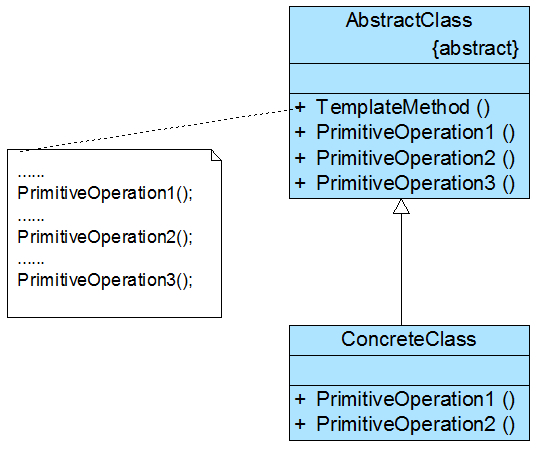
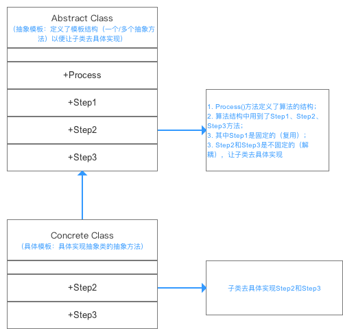

## IOS_TemplateMethodMode

## 模版方法模式

模版方法模式：定义一个操作中算法的框架，而将一些步骤延迟到子类中。模板方法模式使得子类可以不改变一个算法的结构即可重定义该算法的某些特定步骤。

模板方法模式是一种基于继承的代码复用技术，它是一种类行为型模式。

模板方法模式是结构最简单的行为型设计模式，在其结构中只存在父类与子类之间的继承关系。通过使用模板方法模式，可以将一些复杂流程的实现步骤封装在一系列基本方法中，在抽象父类中提供一个称之为模板方法的方法来定义这些基本方法的执行次序，而通过其子类来覆盖某些步骤，从而使得相同的算法框架可以有不同的执行结果。模板方法模式提供了一个模板方法来定义算法框架，而某些具体步骤的实现可以在其子类中完成。

## 类型

行为模式

## 结构图

#### 图1

#### 图2

## 角色

* 抽象类（AbstractClass）：实现了模板方法，定义了算法的骨架。

在抽象类中定义了一系列基本操作(PrimitiveOperations)，这些基本操作可以是具体的，也可以是抽象的，每一个基本操作对应算法的一个步骤，在其子类中可以重定义或实现这些步骤。同时，在抽象类中实现了一个模板方法(Template Method)，用于定义一个算法的框架，模板方法不仅可以调用在抽象类中实现的基本方法，也可以调用在抽象类的子类中实现的基本方法，还可以调用其他对象中的方法。

* 具体类（ConcreteClass）：实现抽象类中的抽象方法，已完成完整的算法。

具体类是抽象类的子类，用于实现在父类中声明的抽象基本操作以完成子类特定算法的步骤，也可以覆盖在父类中已经实现的具体基本操作。

## 拓展

在实现模板方法模式时，开发抽象类的软件设计师和开发具体子类的软件设计师之间可以进行协作。一个设计师负责给出一个算法的轮廓和框架，另一些设计师则负责给出这个算法的各个逻辑步骤。实现这些具体逻辑步骤的方法即为基本方法，而将这些基本方法汇总起来的方法即为模板方法，模板方法模式的名字也因此而来。

### 模版方法和基本方法

#### 模版方法

一个模板方法是定义在抽象类中的、把基本操作方法组合在一起形成一个总算法或一个总行为的方法。这个模板方法定义在抽象类中，并由子类不加以修改地完全继承下来。模板方法是一个具体方法，它给出了一个顶层逻辑框架，而逻辑的组成步骤在抽象类中可以是具体方法，也可以是抽象方法。由于模板方法是具体方法，因此模板方法模式中的抽象层只能是抽象类，而不是接口。

#### 基本方法

基本方法是实现算法各个步骤的方法，是模板方法的组成部分。基本方法又可以分为三种：抽象方法(Abstract Method)、具体方法(Concrete Method)和钩子方法(Hook Method)。

* 抽象方法：一个抽象方法由抽象类声明、由其具体子类实现。（在java语言里一个抽象方法以abstract关键字标识。）

* 具体方法：一个具体方法由一个抽象类或具体类声明并实现，其子类可以进行覆盖也可以直接继承。

* 钩子方法：一个钩子方法由一个抽象类或具体类声明并实现，而其子类可能会加以扩展。通常在父类中给出的实现是一个空实现（可使用virtual关键字将其定义为虚函数），并以该空实现作为方法的默认实现，当然钩子方法也可以提供一个非空的默认实现。

在模板方法模式中，钩子方法有两类：第一类钩子方法可以与一些具体步骤“挂钩”，以实现在不同条件下执行模板方法中的不同步骤，这类钩子方法的返回类型通常是bool类型的，这类方法名一般为IsXXX()，用于对某个条件进行判断，如果条件满足则执行某一步骤，否则将不执行。

一般情况下，钩子方法的返回值为true，如果不希望某方法执行，可以在其子类中覆盖钩子方法，将其返回值改为false即可，这种类型的钩子方法可以控制方法的执行，对一个算法进行约束。

还有一类钩子方法就是实现体为空的具体方法，子类可以根据需要覆盖或者继承这些钩子方法，与抽象方法相比，这类钩子方法的好处在于子类如果没有覆盖父类中定义的钩子方法，编译可以正常通过，但是如果没有覆盖父类中声明的抽象方法，编译将报错。

## 适用场景

1. 有多个子类共有的方法，且逻辑相同。 

2. 重要的、复杂的方法，可以考虑作为模板方法。

3. 一次性实现一个算法的不变的部分，并将可变的行为留给子类来实现。

4. 各子类中公共的行为应被提取出来并集中到一个公共父类中以避免代码重复。

5. 控制子类的扩展，模板方法只在特定点调用“ hook”操作 ，这样就只允许在这些点进行扩展。

## 优缺点

#### 优点

1. 模板方法模式通过把不变的行为搬移到超类，去除了子类中的重复代码。

2. 子类实现算法的某些细节，有助于算法的扩展。

3. 通过一个父类调用子类实现的操作，通过子类扩展增加新的行为，符合“开放-封闭原则”。

#### 缺点

1. 每一个不同的实现都需要一个子类来实现，导致类的个数增加，使得系统更加庞大。

2. 抽象类负责声明最抽象、最一般的事物属性和方法，实现类实现具体的事物属性和方法。在复杂的项目中可能会带来代码阅读的难度。

## 应用示例

 1. 在造房子的时候，地基、走线、水管都一样，只有在建筑的后期才有加壁橱加栅栏等差异。 

 2. 西游记里面菩萨定好的 81 难，这就是一个顶层的逻辑骨架。

 3. spring 中对 Hibernate 的支持，将一些已经定好的方法封装起来，比如开启事务、获取 Session、关闭 Session 等，程序员不重复写那些已经规范好的代码，直接丢一个实体就可以保存。

## 总结

在模板方法模式中，由于面向对象的多态性，子类对象在运行时将覆盖父类对象，子类中定义的方法也将覆盖父类中定义的方法，因此程序在运行时，具体子类的基本方法将覆盖父类中定义的基本方法，子类的钩子方法也将覆盖父类的钩子方法，从而可以通过在子类中实现的钩子方法对父类方法的执行进行约束，实现子类对父类行为的反向控制。

## 参考

stackoverflow 原文见：

[template method pattern in Objective-C](http://stackoverflow.com/questions/8146439/objective-c-template-methods-pattern)

[abstract class in Objective-C](http://stackoverflow.com/questions/1034373/creating-an-abstract-class-in-objective-c)

[模板方法模式深度解析（一）](https://blog.csdn.net/lovelion/article/details/8299794/)

[Java设计模式之模板方法模式（Template Method）](https://blog.csdn.net/jason0539/article/details/45037535)

[模板方法模式（Template Method） - 最易懂的设计模式解析
](https://blog.csdn.net/carson_ho/article/details/54910518)

[iOS开发-模板方法模式](https://www.cnblogs.com/xiaofeixiang/p/5126158.html)

[在objective-c中实现模板方法模式（template method）](https://blog.csdn.net/kyfxbl/article/details/17070211)