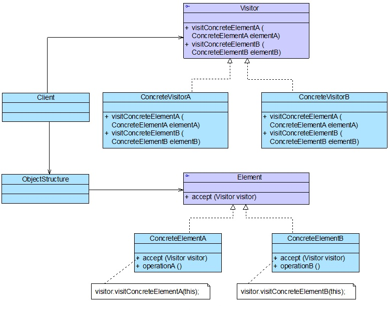
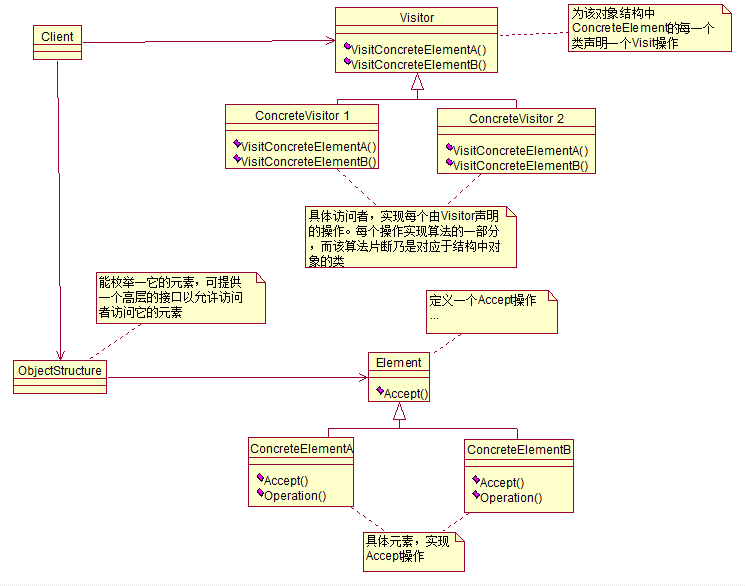

## IOS_VisitorMode

## 访问者模式

访问者模式：表示一个作用于某对象结构中的各元素的操作。它使你可以在不改变各元素类的前提下定义作用于这些元素的新操作。

根据模式，元素对象已接受访问者对象，这样访问者对象就可以处理元素对象上的操作。

## 类型

行为模式

## 结构图

#### 图1

#### 图2

## 角色

1. Visitor（抽象访问者）：抽象访问者为对象结构中每一个具体元素类ConcreteElement声明一个访问操作，从这个操作的名称或参数类型可以清楚知道需要访问的具体元素的类型，具体访问者则需要实现这些操作方法，定义对这些元素的访问操作。

2. ConcreteVisitor（具体访问者）：具体访问者实现了抽象访问者声明的方法，每一个操作作用于访问对象结构中一种类型的元素。

3. Element（抽象元素）：一般是一个抽象类或接口，定义一个Accept方法，该方法通常以一个抽象访问者作为参数。

4. ConcreteElement（具体元素）：具体元素实现了Accept方法，在Accept方法中调用访问者的访问方法以便完成一个元素的操作。

5. ObjectStructure（对象结构）：对象结构是一个元素的集合，用于存放元素对象，且提供便利其内部元素的方法。

## 适用场景

1. 对象结构比较稳定，但经常需要在此对象结构上定义新的操作。

2. 需要对一个对象结构中的对象进行很多不同的且不相关的操作，而需要避免这些操作“污染”这些对象的类，也不希望在增加新操作时修改这些类。

3. 一组对象中，存在着相似的操作，为了避免出现大量重复的代码，也可以将这些重复的操作封装到访问者中去。

## 优缺点

#### 优点

符合单一职责原则：凡是适用访问者模式的场景中，元素类中需要封装在访问者中的操作必定是与元素类本身关系不大且是易变的操作，使用访问者模式一方面符合单一职责原则，另一方面，因为被封装的操作通常来说都是易变的，所以当发生变化时，就可以在不改变元素类本身的前提下，实现对变化部分的扩展。

扩展性良好：元素类可以通过接受不同的访问者来实现对不同操作的扩展。

1. 使得数据结构和作用于结构上的操作解耦，使得操作集合可以独立变化。

2. 添加新的操作或者说访问者会非常容易。

3. 将对各个元素的一组操作集中在一个访问者类当中。

4. 使得类层次结构不改变的情况下，可以针对各个层次做出不同的操作，而不影响类层次结构的完整性。

5. 可以跨越类层次结构，访问不同层次的元素类，做出相应的操作。

#### 缺点

增加新的元素类比较困难。通过访问者模式的代码可以看到，在访问者类中，每一个元素类都有它对应的处理方法，也就是说，每增加一个元素类都需要修改访问者类（也包括访问者类的子类或者实现类），修改起来相当麻烦。也就是说，在元素类数目不确定的情况下，应该慎用访问者模式。所以，访问者模式比较适用于对已有功能的重构，比如说，一个项目的基本功能已经确定下来，元素类的数据已经基本确定下来不会变了，会变的只是这些元素内的相关操作，这时候，我们可以使用访问者模式对原有的代码进行重构一遍，这样一来，就可以在不修改各个元素类的情况下，对原有功能进行修改。

1. 增加新的元素会非常困难。

2. 实现起来比较复杂，会增加系统的复杂性。

3. 破坏封装，如果将访问行为放在各个元素中，则可以不暴露元素的内部结构和状态，但使用访问者模式的时候，为了让访问者能获取到所关心的信息，元素类不得不暴露出一些内部的状态和结构，就像收入和支出类必须提供访问金额和单子的项目的方法一样。

## 参考

[Java设计模式之访问者模式](https://blog.csdn.net/jason0539/article/details/45146271)

[设计模式学习之访问者模式](https://blog.csdn.net/u012124438/article/details/70537203)

[一起学设计模式 - 访问者模式](https://segmentfault.com/a/1190000012495957)

[访问者模式](https://baike.baidu.com/item/%E8%AE%BF%E9%97%AE%E8%80%85%E6%A8%A1%E5%BC%8F/1571621?fr=aladdin)