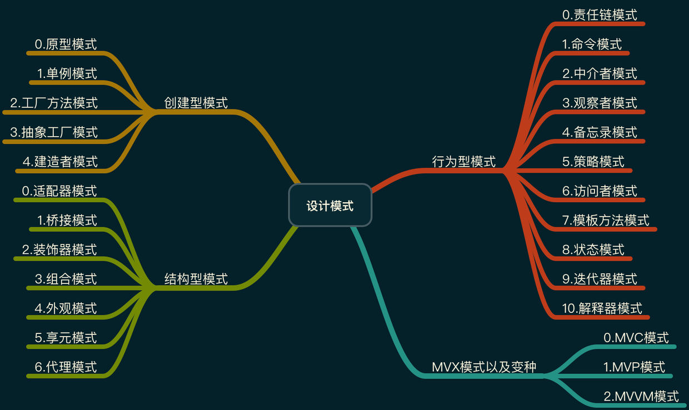

# IOS-DesignMode

## ios 设计模式

### 设计模式种类
设计模式分为三种类型：

1. 创建型模式（5种）：建造者模式、原型模式、单例模式、工厂方法模式、抽象工厂模式。

2. 结构型模式（7种）：适配器模式、代理模式、装饰器模式、外观模式、组合模式、桥接模式、享元模式。

3. 行为型模式（11种）：观察者模式、策略模式、模版方法模式、责任链模式、状态模式、迭代子模式、中介者模式、访问者模式、命令模式、备忘录模式、解释器模式。

4. 并发型模式（8种）：主动对象模式（Active Object）、阻碍模式（Balking）、双重检查锁定（Double Checked Locking）、守卫模式（Guarded）、领导者/追随者模式（Leaders/Followers）、监测对象模式（Monitor object）、读写锁模式（Read write lock）、调度模式（Scheduler）。

5. 线程池模式（2种）：线程特定存储模式（Thread-Specific Storage）、反应器模式（Reactor）。

并发型模式和线程池模式（暂不实现demo）

### 结构图

### 设计模式的六大原则
**总原则：开闭原则**

开闭原则：对拓展开放，对修改封闭。在程序需要拓展时，不能去修改原有代码，而是拓展原代码，实现热插拔效果。使得程序拓展性好，易于维护和升级。

想要达到这样的效果，需要使用抽象类和接口。

#### 六大原则
##### 1.单一原则 (Single Responsibility Principle)
不要存在多于一个使类变更的原因，每个类应该实现单一的职责，否则就应该拆分该类。

##### 2.里氏替换原则 （Liskov Substitution Principle）
任何基类可以出现的地方，子类一定可以出现。里氏替换原则是继承复用的基石，只有当衍生类可以替换基类，软件单位的功能不受到影响时，基类才能真正被复用，而衍生类也能够在基类的基础上增加新的行为。

里氏代换原则是对“开-闭”原则的补充。实现“开闭”原则的关键步骤就是抽象化。而基类与子类的继承关系就是抽象化的具体实现，所以里氏代换原则是对实现抽象化的具体步骤的规范。里氏替换原则中，子类对父类的方法尽量不要重写和重载。因为父类代表了定义好的结构，通过这个规范的接口与外界交互，子类不应该随便破坏它。

##### 3.依赖倒置原则（Dependence Inversion Principle）
面向接口编程，依赖于抽象而不是具体。在编写代码时不应与具体类交互，而应该与具体类的上层接口进行交互。

##### 4.接口隔离原则（Interface Segregation Principle）
每个接口中不存在子类不使用却必须实现的方法，否则就应将接口拆分。使用多个接口比使用单个接口（多个接口方法集合的接口）好。但不是接口拆分的越细越好，而是应该适当的拆分，否则接口的维护也是问题。

##### 5.迪米特法则（最少知道原则）（Demeter Principle）
一个类对自己依赖的类知道的越少越好。无论被依赖的类多么复杂，都应该将逻辑封装在方法的内部，通过公共（public）方法提供给外部。这样当被依赖的类变化时，才能最小的影响该类。

最少知道原则的另一个表达方式是：只与直接的朋友通信。类之间只要有耦合关系，就叫朋友关系。耦合分为依赖、关联、聚合、组合等。我们称出现为成员变量、方法参数、方法返回值中的类为直接朋友。局部变量、临时变量则不是直接的朋友。我们要求陌生的类不要作为局部变量出现在类中。

##### 6.合成复用原则（组合复用原则）（Composite Reuse Principle）
尽量首先使用合成/聚合的方式，而不是使用继承。

**什么是合成?**

合成（组合）：表示一个整体与部分的关系， 指一个依托整体而存在的关系（ 整体与部分 不可以分开 ）,例如:一个人对他的房子和家具,其中他的房子和家具是不能被共享的,因为那些东西都是他自己的。并且人没了,这个也关系就没了。这个例子就好像,乌鸡百凤丸这个产品,它是有乌鸡和上等药材合成而来的一样。 也比如网络游戏中的武器装备合成一样,多种东西合并为一种超强的东西一样。 虽然组合表示的是一个整体与部分的关系，但是组合关系中部分和整体具有统一的生存期。一旦整体对象不存在，部分对象也将不存在，部分对象与整体对象之间具有同生共死的关系。 在组合关系中，成员类是整体类的一部分，而且整体类可以控制成员类的生命周期，即成员类的存在依赖于整体类。

**什么是聚合?**

聚合: 聚合是比合成关系更弱的一种拥有关系,也表示整体与部分的关系（整体与部分可以分开）,例如,一个奔驰S360汽车,对奔驰S360引擎,奔驰S360轮胎的关系..这些关系就是带有聚合性质的。因为奔驰S360引擎和奔驰S360轮胎他们只能被奔驰S360汽车所用,离开了奔驰S360汽车,它们就失去了存在的意义。在我们的设计中,这样的关系不应该频繁出现.这样会增大设计的耦合度。 在面向对象中的聚合：通常在定义一个整体类后，再去分析这个整体类的组成结构，从而找出一些成员类，该整体类和成员类之间就形成了聚合关系。在聚合关系中， 成员类是整体类的一部分，即成员对象是整体对象的一部分，但是成员对象可以脱离整体对象独立存在。

组合和聚合是有很大区别的，这个区别不是在形式上，而是在本质上：
比如A类中包含B类的一个引用b，当A类的一个对象消亡时，b这个引用所指向的对象也同时消亡（没有任何一个引用指向它，成了垃圾对象），这种情况叫做组合，反之b所指向的对象还会有另外的引用指向它，这种情况叫聚合。

在实际写代码时组合方式一般会这样写：

A类的构造方法里创建B类的对象，也就是说，当A类的一个对象产生时，B类的对象随之产生，当A类的这个对象消亡时，它所包含的B类的对象也随之消亡。

聚合方式则是这样：

A类的对象在创建时不会立即创建B类的对象，而是等待一个外界的对象传给它
传给它的这个对象不是A类创建的。
现实生活中：
人和人和手，脚是组合关系，因为当人死亡后人的手也就不复存在了。人和他的电脑是聚合关系

### 创建型模式

[简单工厂模式](https://github.com/detector-m/IOS-DesignMode/blob/master/IOS_DesignMode_Demo/IOS_DesignMode_Demo/IOS_SimpleFactoryMode/IOS_SimpleFactoryMode_README.md)

[建造者模式](https://github.com/detector-m/IOS-DesignMode/blob/master/IOS_DesignMode_Demo/IOS_DesignMode_Demo/IOS_BuilderMode/IOS_BuilderMode_Readme.md)

[原型模式](https://github.com/detector-m/IOS-DesignMode/blob/master/IOS_DesignMode_Demo/IOS_DesignMode_Demo/IOS_PrototypeMode/IOS_PrototypeMode_README.md)

[单例模式](https://github.com/detector-m/IOS-DesignMode/blob/master/IOS_DesignMode_Demo/IOS_DesignMode_Demo/IOS_%20SingletonMode/IOS_SingletonMode_README.md)

### 结构型模式

[适配器模式](https://github.com/detector-m/IOS-DesignMode/blob/master/IOS_DesignMode_Demo/IOS_DesignMode_Demo/IOS_AdapterMode/IOS_AdapterMode_README.md)

[代理模式](https://github.com/detector-m/IOS-DesignMode/blob/master/IOS_DesignMode_Demo/IOS_DesignMode_Demo/IOS_ProxyMode/IOS_ProxyMode_READMD.md)

[外观模式](https://github.com/detector-m/IOS-DesignMode/blob/master/IOS_DesignMode_Demo/IOS_DesignMode_Demo/IOS_FacadeMode/IOA_FacadeMode_README.md)

[装饰者模式](https://github.com/detector-m/IOS-DesignMode/blob/master/IOS_DesignMode_Demo/IOS_DesignMode_Demo/IOS_DecoratorMode/IOS_DecoratorMode_README.md)

[组合模式](https://github.com/detector-m/IOS-DesignMode/blob/master/IOS_DesignMode_Demo/IOS_DesignMode_Demo/IOS_CompositeMode/IOS_CompositeMode_README.md)

[桥接模式](https://github.com/detector-m/IOS-DesignMode/blob/master/IOS_DesignMode_Demo/IOS_DesignMode_Demo/IOS_BridgeMode/IOS_BridgeMode_README.md)

[享元模式](https://github.com/detector-m/IOS-DesignMode/blob/master/IOS_DesignMode_Demo/IOS_DesignMode_Demo/IOS_FlyweightMode/IOS_FlyweightMode_README.md)

### 行为型模式

[观察者模式](https://github.com/detector-m/IOS-DesignMode/blob/master/IOS_DesignMode_Demo/IOS_DesignMode_Demo/IOS_ObserverMode/IOS_ObserverMode_README.md)

[策略模式](https://github.com/detector-m/IOS-DesignMode/blob/master/IOS_DesignMode_Demo/IOS_DesignMode_Demo/IOS_StrategeyMode/IOS_StrategeyMode_README.md)

[责任链（职责链）模式](https://github.com/detector-m/IOS-DesignMode/blob/master/IOS_DesignMode_Demo/IOS_DesignMode_Demo/IOS_ChainOfResponsibilityMode/IOS_ChainOfResponsibilityMode_README.md)

[状态模式](https://github.com/detector-m/IOS-DesignMode/blob/master/IOS_DesignMode_Demo/IOS_DesignMode_Demo/IOS_StateMode/IOS_StateMode_README.md)

[访问者模式](https://github.com/detector-m/IOS-DesignMode/blob/master/IOS_DesignMode_Demo/IOS_DesignMode_Demo/IOS_VisitorMode/IOS_VisitorMode_README.md)

[中介者模式](https://github.com/detector-m/IOS-DesignMode/blob/master/IOS_DesignMode_Demo/IOS_DesignMode_Demo/IOS_MediatorMode/IOA_MediatorMode_README.md)

[命令模式](https://github.com/detector-m/IOS-DesignMode/blob/master/IOS_DesignMode_Demo/IOS_DesignMode_Demo/IOS_CommandMode/IOS_CommandMode_README.md)

[迭代子模式](https://github.com/detector-m/IOS-DesignMode/blob/master/IOS_DesignMode_Demo/IOS_DesignMode_Demo/IOS_IteratorMode/IOS_IteratorMode_README.md)

[模版方法模式](https://github.com/detector-m/IOS-DesignMode/blob/master/IOS_DesignMode_Demo/IOS_DesignMode_Demo/IOS_TemplateMethodMode/IOS_TemplateMethodMode_README.md)

[备忘录模式](https://github.com/detector-m/IOS-DesignMode/blob/master/IOS_DesignMode_Demo/IOS_DesignMode_Demo/IOS_MementoMode/IOS_MementoMode_README.md)

[解释器模式](https://github.com/detector-m/IOS-DesignMode/blob/master/IOS_DesignMode_Demo/IOS_DesignMode_Demo/IOS_InterpreterMode/IOS_InterpreterMode_README.md)

### 参考
[23种设计模式汇总整理](https://blog.csdn.net/jason0539/article/details/44956775)

[设计模式(真实的归宿)](https://blog.csdn.net/hguisu/article/category/1133340)

[设计模式(卡奴达摩的专栏)](https://blog.csdn.net/column/details/pattern.html)

[【专题】设计模式分类](https://www.cnblogs.com/qlee/archive/2011/04/19/2020510.html)

[《JAVA与模式》](http://www.cnblogs.com/java-my-life/)
